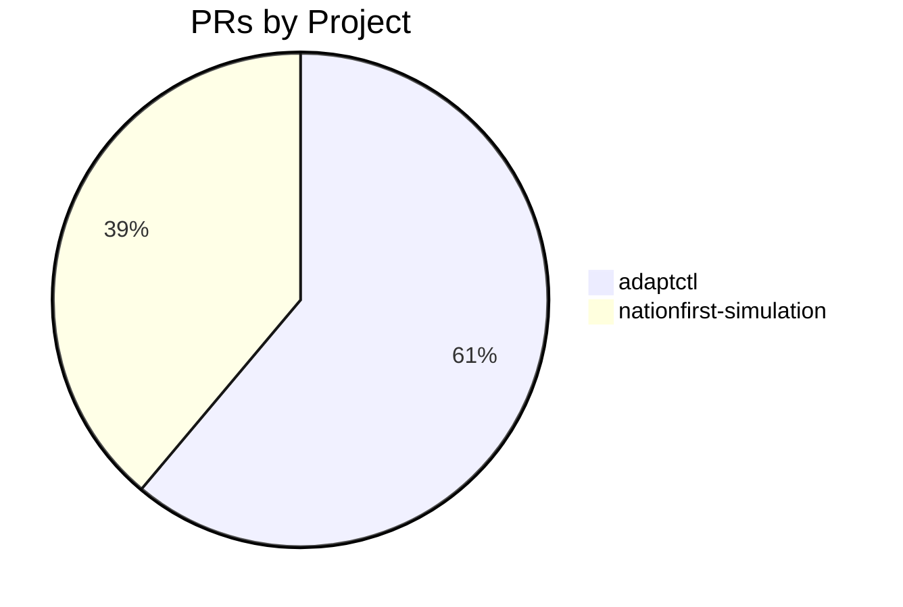
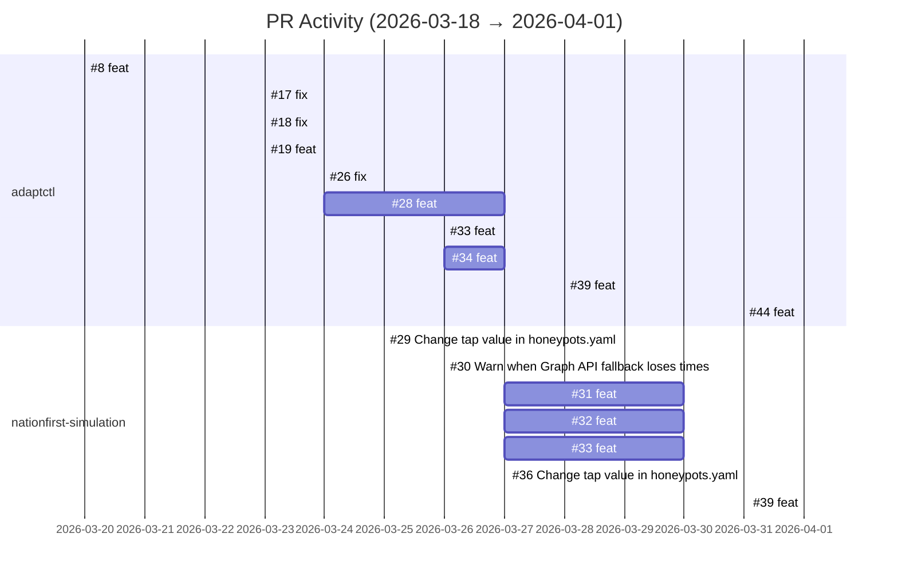

# GitHub Activity Report: 2026-03-18 → 2026-04-01

> **Generated**: 2026-04-02
> **Period**: 14 days

## Activity Summary

| Metric | Count |
|--------|-------|
| Projects active | 3 |
| PRs created | 18 |
| PRs merged | 16 |
| PRs open | 0 |
| Issues opened | 3 |

## PR Distribution

## Activity Timeline

## Pull Requests

### cloud-ecosystem-security/adaptctl

| # | Title | Status | Created |
|---|-------|--------|---------|
| [#8](https://github.com/cloud-ecosystem-security/adaptctl/pull/8) | feat: add --name and --object-id flags to clean keyvault | ✅ Merged | 2026-03-20 |
| [#17](https://github.com/cloud-ecosystem-security/adaptctl/pull/17) | fix: switch keyvault clean to data-plane API for secrets, keys, and certificates | ✅ Merged | 2026-03-23 |
| [#18](https://github.com/cloud-ecosystem-security/adaptctl/pull/18) | fix: handle key vault data-plane kid field and clean ordering | ✅ Merged | 2026-03-23 |
| [#19](https://github.com/cloud-ecosystem-security/adaptctl/pull/19) | feat: replace --object-id with explicit --object-type and --object-name flags | ✅ Merged | 2026-03-23 |
| [#26](https://github.com/cloud-ecosystem-security/adaptctl/pull/26) | fix: switch storage clean to data-plane API to preserve resources | ✅ Merged | 2026-03-24 |
| [#28](https://github.com/cloud-ecosystem-security/adaptctl/pull/28) | feat: add maidap-cleanup script for honeypot data-plane cleanup | ❌ Closed | 2026-03-24 |
| [#33](https://github.com/cloud-ecosystem-security/adaptctl/pull/33) | feat: clean emails from all folders including custom and nested | ✅ Merged | 2026-03-26 |
| [#34](https://github.com/cloud-ecosystem-security/adaptctl/pull/34) | feat: add maidap-cleanup script for cybergym01 environment | ❌ Closed | 2026-03-26 |
| [#39](https://github.com/cloud-ecosystem-security/adaptctl/pull/39) | feat: add --lookback flag to clean keyvault command | ✅ Merged | 2026-03-28 |
| [#44](https://github.com/cloud-ecosystem-security/adaptctl/pull/44) | feat: add `adaptctl update` command for in-place self-update | ✅ Merged | 2026-03-31 |
| [#45](https://github.com/cloud-ecosystem-security/adaptctl/pull/45) | feat: add --lookback flag to clean storageaccount | ✅ Merged | 2026-04-01 |

### cloud-ecosystem-security/nationfirst-simulation

| # | Title | Status | Created |
|---|-------|--------|---------|
| [#29](https://github.com/cloud-ecosystem-security/nationfirst-simulation/pull/29) | Change tap value in honeypots.yaml | ✅ Merged | 2026-03-25 |
| [#30](https://github.com/cloud-ecosystem-security/nationfirst-simulation/pull/30) | Warn when Graph API fallback loses timestamp spoofing | ✅ Merged | 2026-03-26 |
| [#31](https://github.com/cloud-ecosystem-security/nationfirst-simulation/pull/31) | feat: add cleanup script for cybergym data-plane honeypot injections | ✅ Merged | 2026-03-27 |
| [#32](https://github.com/cloud-ecosystem-security/nationfirst-simulation/pull/32) | feat: add nationfirst data-plane cleanup script | ✅ Merged | 2026-03-27 |
| [#33](https://github.com/cloud-ecosystem-security/nationfirst-simulation/pull/33) | feat: add nelson.muntz mailbox delegation script | ✅ Merged | 2026-03-27 |
| [#36](https://github.com/cloud-ecosystem-security/nationfirst-simulation/pull/36) | Change tap value in honeypots.yaml | ✅ Merged | 2026-03-31 |
| [#39](https://github.com/cloud-ecosystem-security/nationfirst-simulation/pull/39) | feat: preserve TAP values across honeypots.yaml regeneration | ✅ Merged | 2026-04-01 |

## Issues

| # | Title | Repository | Status |
|---|-------|-----------|--------|
| [#43](https://github.com/cloud-ecosystem-security/adaptctl/issues/43) | feat: add `adaptctl update` command for in-place self-update | cloud-ecosystem-security/adaptctl | ✅ Closed |
| [#29](https://github.com/cloud-ecosystem-security/adaptctl/issues/29) | Bug: auth app-setup doesn't save credentials when app already exists | cloud-ecosystem-security/adaptctl | ✅ Closed |
| [#27](https://github.com/cloud-ecosystem-security/adaptctl/issues/27) | Feature: Add optional --from flag for time-based resource cleanup filtering | cloud-ecosystem-security/adaptctl | ✅ Closed |

## Active Repositories

| Repository | Description | Last Push |
|-----------|-------------|-----------|
| [cloud-ecosystem-security/nationfirst-simulation](https://github.com/cloud-ecosystem-security/nationfirst-simulation) | Adapt research - resources to deploy nationfirst simulation | 2026-04-02 |
| [cloud-ecosystem-security/adaptctl](https://github.com/cloud-ecosystem-security/adaptctl) | Utility for managing simulation environments | 2026-04-01 |
| [cloud-ecosystem-security/ridgeline-simulation](https://github.com/cloud-ecosystem-security/ridgeline-simulation) | Adapt research - resources to deploy ridgeline simulation | 2026-04-01 |
