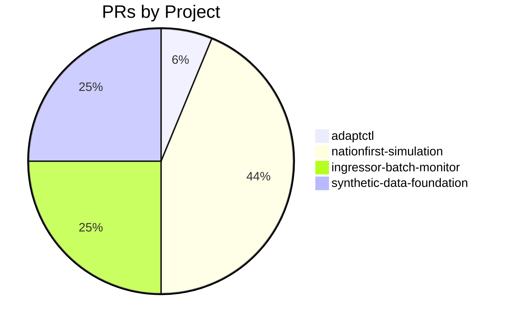

# GitHub Activity Report: 2026-04-01 → 2026-04-21

> **Generated**: 2026-04-23
> **Period**: 20 days

## Activity Summary

| Metric | Count |
|--------|-------|
| Projects active | 4 |
| PRs created | 16 |
| PRs merged | 15 |
| PRs open | 1 |
| Issues opened | 3 |

## Highlights

### 🚀 New Features

- **adaptctl**: feat: add --lookback flag to clean storageaccount ([#45](https://github.com/cloud-ecosystem-security/adaptctl/pull/45))
- **nationfirst-simulation**: feat: preserve TAP values across honeypots.yaml regeneration ([#39](https://github.com/cloud-ecosystem-security/nationfirst-simulation/pull/39))
- **nationfirst-simulation**: feat: add adaptresearch003 data-plane cleanup script ([#40](https://github.com/cloud-ecosystem-security/nationfirst-simulation/pull/40))
- **nationfirst-simulation**: feat: auto-generate cleanup scripts during honeypots.yaml generation ([#41](https://github.com/cloud-ecosystem-security/nationfirst-simulation/pull/41))
- **nationfirst-simulation**: feat: add attack scenario users, payments workload, and SharePoint site ([#44](https://github.com/cloud-ecosystem-security/nationfirst-simulation/pull/44))
- **nationfirst-simulation**: feat: add killchain users and kv-prod-payments-use to honeypots inventory ([#45](https://github.com/cloud-ecosystem-security/nationfirst-simulation/pull/45))

### 🔧 Bug Fixes & Improvements

- **nationfirst-simulation**: fix: address code review feedback on TAP backport PR ([#42](https://github.com/cloud-ecosystem-security/nationfirst-simulation/pull/42))
- **nationfirst-simulation**: fix: address code review feedback on TAP generation backport ([#43](https://github.com/cloud-ecosystem-security/nationfirst-simulation/pull/43))

### ⚙️ CI/CD & Automation

- **synthetic-data-foundation**: Add daily issue reminder workflow ([#5](https://github.com/nelsoncheng_microsoft/synthetic-data-foundation/pull/5))

### 📝 Documentation

- **ingressor-batch-monitor**: docs: clarify spec phase status in README ([#1](https://github.com/nelsoncheng_microsoft/ingressor-batch-monitor/pull/1))
- **synthetic-data-foundation**: docs: Acar brainstorming meeting notes & consumer demand signal ([#1](https://github.com/nelsoncheng_microsoft/synthetic-data-foundation/pull/1))
- **synthetic-data-foundation**: docs: Noah brainstorming meeting notes & red team demand signal ([#2](https://github.com/nelsoncheng_microsoft/synthetic-data-foundation/pull/2))

### 🧹 Code Health

- **synthetic-data-foundation**: Remove daily issue reminder workflow ([#7](https://github.com/nelsoncheng_microsoft/synthetic-data-foundation/pull/7))

### 📦 Other Work

- **ingressor-batch-monitor**: mission: tighten CLI shape, ingressor ref pinning, at-a-glance monitor signal ([#2](https://github.com/nelsoncheng_microsoft/ingressor-batch-monitor/pull/2))
- **ingressor-batch-monitor**: mission: add Terminology section ([#3](https://github.com/nelsoncheng_microsoft/ingressor-batch-monitor/pull/3))
- **ingressor-batch-monitor**: spec: requirements.md skeleton (structure-only) ([#4](https://github.com/nelsoncheng_microsoft/ingressor-batch-monitor/pull/4))

### 📋 Issues Opened

- **synthetic-data-foundation**: Daily Issue Reminders ([#6](https://github.com/nelsoncheng_microsoft/synthetic-data-foundation/issues/6))
- **synthetic-data-foundation**: Explore synthetic graph data generation for red agent (Ingressor) GNN training ([#4](https://github.com/nelsoncheng_microsoft/synthetic-data-foundation/issues/4))
- **synthetic-data-foundation**: Follow up: Orchestration meeting, Siva sync, Acar notification ([#3](https://github.com/nelsoncheng_microsoft/synthetic-data-foundation/issues/3))

## PR Distribution



## Activity Timeline

```mermaid
gantt
    title PR Activity (2026-04-01 → 2026-04-21)
    dateFormat YYYY-MM-DD
    section adaptctl
    #45 feat: add --lookback flag to clean stora :done, 2026-04-01, 2026-04-01
    section nationfirst-simulation
    #39 feat: preserve TAP values across honeypo :done, 2026-04-01, 2026-04-01
    #40 feat: add adaptresearch003 data-plane cl :done, 2026-04-07, 2026-04-07
    #41 feat: auto-generate cleanup scripts duri :done, 2026-04-08, 2026-04-10
    #42 fix: address code review feedback on TAP :done, 2026-04-08, 2026-04-08
    #43 fix: address code review feedback on TAP :done, 2026-04-08, 2026-04-08
    #44 feat: add attack scenario users, payment :done, 2026-04-09, 2026-04-10
    #45 feat: add killchain users and kv-prod-pa :done, 2026-04-14, 2026-04-14
    section ingressor-batch-monitor
    #1 docs: clarify spec phase status in READM :done, 2026-04-20, 2026-04-20
    #2 mission: tighten CLI shape, ingressor re :done, 2026-04-20, 2026-04-21
    #3 mission: add Terminology section :done, 2026-04-21, 2026-04-21
    #4 spec: requirements.md skeleton (structur :active, 2026-04-21, 2026-04-21
    section synthetic-data-foundation
    #1 docs: Acar brainstorming meeting notes & :done, 2026-04-12, 2026-04-12
    #2 docs: Noah brainstorming meeting notes & :done, 2026-04-12, 2026-04-12
    #5 Add daily issue reminder workflow :done, 2026-04-12, 2026-04-12
    #7 Remove daily issue reminder workflow :done, 2026-04-17, 2026-04-17
```

## Pull Requests

### cloud-ecosystem-security/adaptctl

| # | Title | Status | Created |
|---|-------|--------|---------|
| [#45](https://github.com/cloud-ecosystem-security/adaptctl/pull/45) | feat: add --lookback flag to clean storageaccount | ✅ Merged | 2026-04-01 |

### cloud-ecosystem-security/nationfirst-simulation

| # | Title | Status | Created |
|---|-------|--------|---------|
| [#39](https://github.com/cloud-ecosystem-security/nationfirst-simulation/pull/39) | feat: preserve TAP values across honeypots.yaml regeneration | ✅ Merged | 2026-04-01 |
| [#40](https://github.com/cloud-ecosystem-security/nationfirst-simulation/pull/40) | feat: add adaptresearch003 data-plane cleanup script | ✅ Merged | 2026-04-07 |
| [#41](https://github.com/cloud-ecosystem-security/nationfirst-simulation/pull/41) | feat: auto-generate cleanup scripts during honeypots.yaml generation | ✅ Merged | 2026-04-08 |
| [#42](https://github.com/cloud-ecosystem-security/nationfirst-simulation/pull/42) | fix: address code review feedback on TAP backport PR | ✅ Merged | 2026-04-08 |
| [#43](https://github.com/cloud-ecosystem-security/nationfirst-simulation/pull/43) | fix: address code review feedback on TAP generation backport | ✅ Merged | 2026-04-08 |
| [#44](https://github.com/cloud-ecosystem-security/nationfirst-simulation/pull/44) | feat: add attack scenario users, payments workload, and SharePoint site | ✅ Merged | 2026-04-09 |
| [#45](https://github.com/cloud-ecosystem-security/nationfirst-simulation/pull/45) | feat: add killchain users and kv-prod-payments-use to honeypots inventory | ✅ Merged | 2026-04-14 |

### nelsoncheng_microsoft/ingressor-batch-monitor

| # | Title | Status | Created |
|---|-------|--------|---------|
| [#1](https://github.com/nelsoncheng_microsoft/ingressor-batch-monitor/pull/1) | docs: clarify spec phase status in README | ✅ Merged | 2026-04-20 |
| [#2](https://github.com/nelsoncheng_microsoft/ingressor-batch-monitor/pull/2) | mission: tighten CLI shape, ingressor ref pinning, at-a-glance monitor signal | ✅ Merged | 2026-04-20 |
| [#3](https://github.com/nelsoncheng_microsoft/ingressor-batch-monitor/pull/3) | mission: add Terminology section | ✅ Merged | 2026-04-21 |
| [#4](https://github.com/nelsoncheng_microsoft/ingressor-batch-monitor/pull/4) | spec: requirements.md skeleton (structure-only) | 🔵 Open | 2026-04-21 |

### nelsoncheng_microsoft/synthetic-data-foundation

| # | Title | Status | Created |
|---|-------|--------|---------|
| [#1](https://github.com/nelsoncheng_microsoft/synthetic-data-foundation/pull/1) | docs: Acar brainstorming meeting notes & consumer demand signal | ✅ Merged | 2026-04-12 |
| [#2](https://github.com/nelsoncheng_microsoft/synthetic-data-foundation/pull/2) | docs: Noah brainstorming meeting notes & red team demand signal | ✅ Merged | 2026-04-12 |
| [#5](https://github.com/nelsoncheng_microsoft/synthetic-data-foundation/pull/5) | Add daily issue reminder workflow | ✅ Merged | 2026-04-12 |
| [#7](https://github.com/nelsoncheng_microsoft/synthetic-data-foundation/pull/7) | Remove daily issue reminder workflow | ✅ Merged | 2026-04-17 |

## Issues

| # | Title | Repository | Status |
|---|-------|-----------|--------|
| [#6](https://github.com/nelsoncheng_microsoft/synthetic-data-foundation/issues/6) | Daily Issue Reminders | nelsoncheng_microsoft/synthetic-data-foundation | ✅ Closed |
| [#4](https://github.com/nelsoncheng_microsoft/synthetic-data-foundation/issues/4) | Explore synthetic graph data generation for red agent (Ingressor) GNN training | nelsoncheng_microsoft/synthetic-data-foundation | 🔵 Open |
| [#3](https://github.com/nelsoncheng_microsoft/synthetic-data-foundation/issues/3) | Follow up: Orchestration meeting, Siva sync, Acar notification | nelsoncheng_microsoft/synthetic-data-foundation | 🔵 Open |

## Active Repositories

| Repository | Description | Last Push |
|-----------|-------------|-----------|
| [cloud-ecosystem-security/adaptctl](https://github.com/cloud-ecosystem-security/adaptctl) | Utility for managing simulation environments | 2026-04-22 |
| [nelsoncheng_microsoft/ingressor-batch-monitor](https://github.com/nelsoncheng_microsoft/ingressor-batch-monitor) | Stop-gap CLI to launch, monitor, and aggregate stats for ingressor red-team batc | 2026-04-21 |
| [cloud-ecosystem-security/nationfirst-simulation](https://github.com/cloud-ecosystem-security/nationfirst-simulation) | Adapt research - resources to deploy nationfirst simulation | 2026-04-20 |
| [nelsoncheng_microsoft/synthetic-data-foundation](https://github.com/nelsoncheng_microsoft/synthetic-data-foundation) | ADAPT Synthetic Data Foundation — data platform for simulation telemetry, labele | 2026-04-17 |
