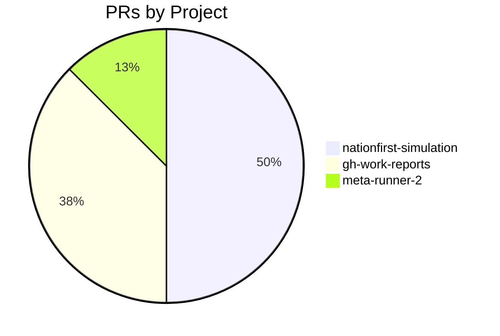
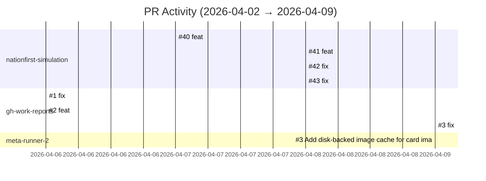

# GitHub Activity Report: 2026-04-02 → 2026-04-09

> **Generated**: 2026-04-09
> **Period**: 7 days

## Activity Summary

| Metric | Count |
|--------|-------|
| Projects active | 19 |
| PRs created | 8 |
| PRs merged | 7 |
| PRs open | 1 |
| Issues opened | 0 |

## PR Distribution

## Activity Timeline

## Pull Requests

### cloud-ecosystem-security/nationfirst-simulation

| # | Title | Status | Created |
|---|-------|--------|---------|
| [#40](https://github.com/cloud-ecosystem-security/nationfirst-simulation/pull/40) | feat: add adaptresearch003 data-plane cleanup script | ✅ Merged | 2026-04-07 |
| [#41](https://github.com/cloud-ecosystem-security/nationfirst-simulation/pull/41) | feat: auto-generate cleanup scripts during honeypots.yaml generation | 🔵 Open | 2026-04-08 |
| [#42](https://github.com/cloud-ecosystem-security/nationfirst-simulation/pull/42) | fix: address code review feedback on TAP backport PR | ✅ Merged | 2026-04-08 |
| [#43](https://github.com/cloud-ecosystem-security/nationfirst-simulation/pull/43) | fix: address code review feedback on TAP generation backport | ✅ Merged | 2026-04-08 |

### nlscng/gh-work-reports

| # | Title | Status | Created |
|---|-------|--------|---------|
| [#1](https://github.com/nlscng/gh-work-reports/pull/1) | fix: add git pull --rebase before push in workflows | ✅ Merged | 2026-04-06 |
| [#2](https://github.com/nlscng/gh-work-reports/pull/2) | feat: dual-token support for multi-account reports | ✅ Merged | 2026-04-06 |
| [#3](https://github.com/nlscng/gh-work-reports/pull/3) | fix: dual-account repo gathering and README | ✅ Merged | 2026-04-09 |

### nlscng/meta-runner-2

| # | Title | Status | Created |
|---|-------|--------|---------|
| [#3](https://github.com/nlscng/meta-runner-2/pull/3) | Add disk-backed image cache for card images | ✅ Merged | 2026-04-09 |

## Active Repositories

| Repository | Description | Last Push |
|-----------|-------------|-----------|
| [nlscng/gh-work-reports](https://github.com/nlscng/gh-work-reports) | Automated GitHub activity reports | 2026-04-09 |
| [nlscng/meta-runner-2](https://github.com/nlscng/meta-runner-2) | Agentic Netrunner meta learning agent — teaches metagame concepts through adapti | 2026-04-09 |
| [nlscng/ai-agents-for-beginners](https://github.com/nlscng/ai-agents-for-beginners) | — | 2026-04-09 |
| [cloud-ecosystem-security/Powderfinger](https://github.com/cloud-ecosystem-security/Powderfinger) | Dynamic generation of killchain resources from descriptions of weaknesses - inte | 2026-04-09 |
| [cloud-ecosystem-security/nationfirst-simulation](https://github.com/cloud-ecosystem-security/nationfirst-simulation) | Adapt research - resources to deploy nationfirst simulation | 2026-04-08 |
| [cloud-ecosystem-security/cybergym](https://github.com/cloud-ecosystem-security/cybergym) | Agentic AI Wargaming Cyber Gym Service | 2026-04-08 |
| [cloud-ecosystem-security/SedanDelivery](https://github.com/cloud-ecosystem-security/SedanDelivery) | GraphDB with GQL engine in rust on top of Redis | 2026-04-08 |
| [nelsoncheng_microsoft/synthetic-data-foundation](https://github.com/nelsoncheng_microsoft/synthetic-data-foundation) | ADAPT Synthetic Data Foundation — data platform for simulation telemetry, labele | 2026-04-08 |
| [cloud-ecosystem-security/adaptctl](https://github.com/cloud-ecosystem-security/adaptctl) | Utility for managing simulation environments | 2026-04-07 |
| [cloud-ecosystem-security/ridgeline-simulation](https://github.com/cloud-ecosystem-security/ridgeline-simulation) | Adapt research - resources to deploy ridgeline simulation | 2026-04-07 |
| [nelsoncheng_microsoft/gh-work-reports](https://github.com/nelsoncheng_microsoft/gh-work-reports) | Automated GitHub work reports with GitHub Pages | 2026-04-06 |
| [cloud-ecosystem-security/hyenas](https://github.com/cloud-ecosystem-security/hyenas) | Hyenas to discover and validate the security bugs | 2026-04-09 |
| [cloud-ecosystem-security/hyenas-windows-prove](https://github.com/cloud-ecosystem-security/hyenas-windows-prove) | Hyenas Prove for Windows | 2026-04-09 |
| [cloud-ecosystem-security/hyenas-plugins](https://github.com/cloud-ecosystem-security/hyenas-plugins) | Hyenas Plugins | 2026-04-09 |
| [cloud-ecosystem-security/ontolohunt](https://github.com/cloud-ecosystem-security/ontolohunt) | OntoloHunt on EMU | 2026-04-09 |
| [cloud-ecosystem-security/repromcp](https://github.com/cloud-ecosystem-security/repromcp) | repromcp | 2026-04-09 |
| [cloud-ecosystem-security/project-helix](https://github.com/cloud-ecosystem-security/project-helix) | project-helix | 2026-04-09 |
| [cloud-ecosystem-security/gremlinox](https://github.com/cloud-ecosystem-security/gremlinox) | High-performance in-memory Gremlin graph engine implemented in Rust with Python  | 2026-04-08 |
| [cloud-ecosystem-security/hyenas-artifacts](https://github.com/cloud-ecosystem-security/hyenas-artifacts) | Hyenas artifacts to navigate the scanning results | 2026-04-07 |
