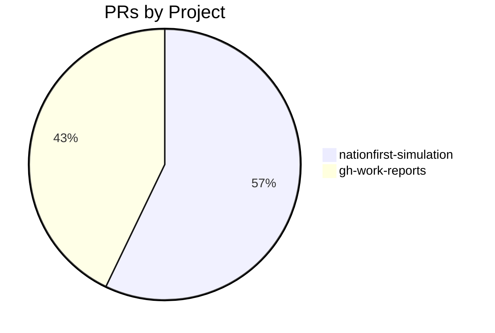
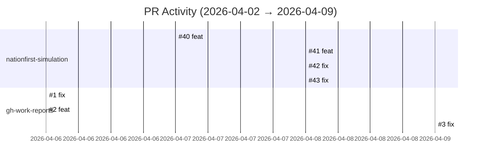

# GitHub Activity Report: 2026-04-02 → 2026-04-09

> **Generated**: 2026-04-09
> **Period**: 7 days

## Activity Summary

| Metric | Count |
|--------|-------|
| Projects active | 2 |
| PRs created | 7 |
| PRs merged | 6 |
| PRs open | 1 |
| Issues opened | 0 |

## PR Distribution

## Activity Timeline

## Pull Requests

### cloud-ecosystem-security/nationfirst-simulation

| # | Title | Status | Created |
|---|-------|--------|---------|
| [#40](https://github.com/cloud-ecosystem-security/nationfirst-simulation/pull/40) | feat: add adaptresearch003 data-plane cleanup script | ✅ Merged | 2026-04-07 |
| [#41](https://github.com/cloud-ecosystem-security/nationfirst-simulation/pull/41) | feat: auto-generate cleanup scripts during honeypots.yaml generation | 🔵 Open | 2026-04-08 |
| [#42](https://github.com/cloud-ecosystem-security/nationfirst-simulation/pull/42) | fix: address code review feedback on TAP backport PR | ✅ Merged | 2026-04-08 |
| [#43](https://github.com/cloud-ecosystem-security/nationfirst-simulation/pull/43) | fix: address code review feedback on TAP generation backport | ✅ Merged | 2026-04-08 |

### nlscng/gh-work-reports

| # | Title | Status | Created |
|---|-------|--------|---------|
| [#1](https://github.com/nlscng/gh-work-reports/pull/1) | fix: add git pull --rebase before push in workflows | ✅ Merged | 2026-04-06 |
| [#2](https://github.com/nlscng/gh-work-reports/pull/2) | feat: dual-token support for multi-account reports | ✅ Merged | 2026-04-06 |
| [#3](https://github.com/nlscng/gh-work-reports/pull/3) | fix: dual-account repo gathering and README | ✅ Merged | 2026-04-09 |

## Active Repositories

| Repository | Description | Last Push |
|-----------|-------------|-----------|
| [nlscng/gh-work-reports](https://github.com/nlscng/gh-work-reports) | Automated GitHub activity reports | 2026-04-09 |
| [cloud-ecosystem-security/nationfirst-simulation](https://github.com/cloud-ecosystem-security/nationfirst-simulation) | Adapt research - resources to deploy nationfirst simulation | 2026-04-08 |
