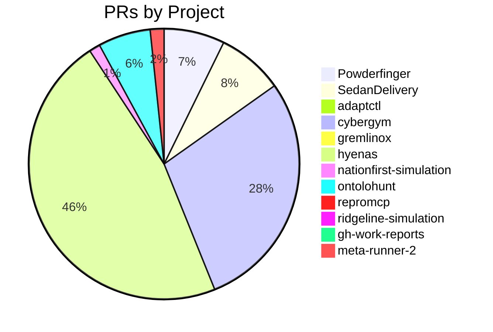

# GitHub Activity Report: 2026-04-02 → 2026-04-09

> **Generated**: 2026-04-09
> **Period**: 7 days

## Activity Summary

| Metric | Count |
|--------|-------|
| Projects active | 19 |
| PRs created | 312 |
| PRs merged | 263 |
| PRs open | 28 |
| Issues opened | 0 |

## PR Distribution



## Activity Timeline

```mermaid
gantt
    title PR Activity (2026-04-02 → 2026-04-09)
    dateFormat YYYY-MM-DD
    section Powderfinger
    #3 feat: merger dedup, resource scoping, pr :done, 2026-04-07, 2026-04-07
    #4 feat: terraform validate passes for all  :done, 2026-04-07, 2026-04-07
    #5 feat: terraform validate CI step, update :done, 2026-04-07, 2026-04-07
    #7 feat: Repeatable Azure deployment with d :done, 2026-04-07, 2026-04-07
    #9 feat: Live validation probes for deploye :done, 2026-04-07, 2026-04-07
    #11 feat: Expand terrain rules to 35 CWEs (9 :done, 2026-04-07, 2026-04-07
    #13 feat: Recipe runner CLI with YAML workfl :done, 2026-04-07, 2026-04-07
    #15 docs: Update README with recipe commands :done, 2026-04-07, 2026-04-08
    #17 feat: Phase 2 — 100 CWE terrain rules, f :done, 2026-04-08, 2026-04-08
    #19 feat: Killchain library (31 attack patte :done, 2026-04-08, 2026-04-08
    section SedanDelivery
    #1154 feat(sd2-redis-store): wire CachedGraphS :done, 2026-04-01, 2026-04-03
    #1155 chore: grant jdellamore_microsoft Mainta :active, 2026-04-02, 2026-04-09
    #1158 fix: remove silent fallback causing 10M  :done, 2026-04-02, 2026-04-02
    #1159 fix: eliminate silent fallbacks and enfo :done, 2026-04-02, 2026-04-02
    #1161 fix: enforce no-silent-fallbacks philoso :done, 2026-04-02, 2026-04-02
    #1162 fix: eliminate philosophy violations acr :active, 2026-04-02, 2026-04-09
    #1164 Rebase fix/1090-row-limit-v2 onto origin :done, 2026-04-02, 2026-04-02
    #1170 fix: remove silent index scan fallback a :done, 2026-04-02, 2026-04-02
    #1171 fix: remove index scan fallback and make :done, 2026-04-02, 2026-04-02
    #1174 fix: eliminate silent index scan fallbac :done, 2026-04-02, 2026-04-02
    section adaptctl
    #48 feat: integrate Intune diagnostic logs i :done, 2026-04-07, 2026-04-07
    section cybergym
    #1235 docs(quickstart): add and refine develop :active, 2026-04-02, 2026-04-09
    #1236 perf: increase edge UNWIND batch to 50 — :done, 2026-04-02, 2026-04-02
    #1237 fix: revert edge batch to 25 — 10M limit :done, 2026-04-02, 2026-04-02
    #1238 fix(mini): handle one-shot init services :done, 2026-04-02, 2026-04-02
    #1240 diag: add edge type to batch failure log :done, 2026-04-03, 2026-04-03
    #1242 feat(mini): wire Azure OpenAI env vars f :done, 2026-04-03, 2026-04-03
    #1245 perf: increase edge UNWIND batch to 50 — :done, 2026-04-03, 2026-04-03
    #1246 fix: add transient retry for edge batch  :done, 2026-04-03, 2026-04-03
    #1247 fix: multi-retry edge batches on transie :done, 2026-04-03, 2026-04-03
    #1248 chore: disable all engine:claude agentic :done, 2026-04-03, 2026-04-03
    section gremlinox
    #51 Add math() step and lookahead/lookbehind :done, 2026-04-02, 2026-04-02
    #52 chore(deps-dev): bump vite from 8.0.3 to :active, 2026-04-06, 2026-04-09
    #53 ci: add Windows wheel builds to package  :done, 2026-04-08, 2026-04-08
    section hyenas
    #120 made sarif import a bit more efficient,  :done, 2026-03-28, 2026-04-02
    #193 feat: add --deep option to hyenas scan :done, 2026-04-01, 2026-04-02
    #202 fix: eliminate terminal UI flicker and r :done, 2026-04-02, 2026-04-02
    #203 Rename module to scope :done, 2026-04-02, 2026-04-02
    #205 Refactor scan load and validate context :done, 2026-04-02, 2026-04-02
    #206 fix(prepare): use scope paths for scoped :done, 2026-04-02, 2026-04-02
    #209 Remove scope usage from scan stage :done, 2026-04-02, 2026-04-02
    #211 Refactor scan generate-ranking step :done, 2026-04-02, 2026-04-02
    #213 Move scan agent catalogue to refactor sc :done, 2026-04-02, 2026-04-02
    #215 Tighten test guidance and remove low-val :done, 2026-04-02, 2026-04-02
    section nationfirst-simulation
    #40 feat: add adaptresearch003 data-plane cl :done, 2026-04-07, 2026-04-07
    #41 feat: auto-generate cleanup scripts duri :active, 2026-04-08, 2026-04-08
    #42 fix: address code review feedback on TAP :done, 2026-04-08, 2026-04-08
    #43 fix: address code review feedback on TAP :done, 2026-04-08, 2026-04-08
    section ontolohunt
    #19 Bump flatted from 3.3.3 to 3.4.2 in /src :done, 2026-03-21, 2026-04-04
    #20 Bump next from 15.5.12 to 15.5.14 in /sr :done, 2026-03-22, 2026-04-04
    #21 Bump picomatch from 2.3.1 to 2.3.2 in /s :done, 2026-03-26, 2026-04-04
    #22 Bump picomatch in /src/ui/report :done, 2026-03-26, 2026-04-04
    #23 Bump yaml from 1.10.2 to 1.10.3 in /src/ :done, 2026-03-26, 2026-04-04
    #24 Bump dompurify from 3.3.1 to 3.3.3 in /s :done, 2026-03-28, 2026-04-04
    #28 feat: Add Ridgeline scenario with verifi :done, 2026-04-04, 2026-04-04
    #30 feat(rl): sweep v4 — statistically signi :done, 2026-04-04, 2026-04-06
    #31 feat: integrate RL-guided relationship r :done, 2026-04-04, 2026-04-06
    #32 Update CONTRIBUTING.md with PR expectati :done, 2026-04-04, 2026-04-04
    section repromcp
    #3 User/adamrhodes/error detection :done, 2026-04-02, 2026-04-02
    #4 Bump hono from 4.12.9 to 4.12.12 :done, 2026-04-08, 2026-04-08
    #5 chore: add workflow_dispatch to release  :done, 2026-04-08, 2026-04-08
    #6 Bump @hono/node-server from 1.19.11 to 1 :done, 2026-04-08, 2026-04-08
    #7 Enhance logging and refactor device conn :active, 2026-04-09, 2026-04-09
    section ridgeline-simulation
    #13 Bump vite from 7.3.1 to 7.3.2 in /applic :active, 2026-04-07, 2026-04-09
    section gh-work-reports
    #1 fix: add git pull --rebase before push i :done, 2026-04-06, 2026-04-06
    #2 feat: dual-token support for multi-accou :done, 2026-04-06, 2026-04-06
    #3 fix: dual-account repo gathering and REA :done, 2026-04-09, 2026-04-09
    section meta-runner-2
    #3 Add disk-backed image cache for card ima :done, 2026-04-09, 2026-04-09
```

## Pull Requests

### cloud-ecosystem-security/Powderfinger

| # | Title | Status | Created |
|---|-------|--------|---------|
| [#3](https://github.com/cloud-ecosystem-security/Powderfinger/pull/3) | feat: merger dedup, resource scoping, providers.tf with azuread | ✅ Merged | 2026-04-07 |
| [#4](https://github.com/cloud-ecosystem-security/Powderfinger/pull/4) | feat: terraform validate passes for all 12 reference killchains | ✅ Merged | 2026-04-07 |
| [#5](https://github.com/cloud-ecosystem-security/Powderfinger/pull/5) | feat: terraform validate CI step, updated README, QA scenarios | ✅ Merged | 2026-04-07 |
| [#7](https://github.com/cloud-ecosystem-security/Powderfinger/pull/7) | feat: Repeatable Azure deployment with deploy-pipeline command | ✅ Merged | 2026-04-07 |
| [#9](https://github.com/cloud-ecosystem-security/Powderfinger/pull/9) | feat: Live validation probes for deployed infrastructure | ✅ Merged | 2026-04-07 |
| [#11](https://github.com/cloud-ecosystem-security/Powderfinger/pull/11) | feat: Expand terrain rules to 35 CWEs (9 new) | ✅ Merged | 2026-04-07 |
| [#13](https://github.com/cloud-ecosystem-security/Powderfinger/pull/13) | feat: Recipe runner CLI with YAML workflow execution | ✅ Merged | 2026-04-07 |
| [#15](https://github.com/cloud-ecosystem-security/Powderfinger/pull/15) | docs: Update README with recipe commands and current stats | ✅ Merged | 2026-04-07 |
| [#17](https://github.com/cloud-ecosystem-security/Powderfinger/pull/17) | feat: Phase 2 — 100 CWE terrain rules, flashcard generator, template validation | ✅ Merged | 2026-04-08 |
| [#19](https://github.com/cloud-ecosystem-security/Powderfinger/pull/19) | feat: Killchain library (31 attack patterns) and README diagram | ✅ Merged | 2026-04-08 |
| [#21](https://github.com/cloud-ecosystem-security/Powderfinger/pull/21) | feat: Multi-chain deploy from killchain library | ✅ Merged | 2026-04-08 |
| [#23](https://github.com/cloud-ecosystem-security/Powderfinger/pull/23) | fix: Phase 3 security fixes — 6 vulnerabilities addressed | ✅ Merged | 2026-04-08 |
| [#25](https://github.com/cloud-ecosystem-security/Powderfinger/pull/25) | fix: Phase 2 terraform generation correctness | ✅ Merged | 2026-04-08 |
| [#27](https://github.com/cloud-ecosystem-security/Powderfinger/pull/27) | Phase 3-4: Quality cleanup — derives, dead code, 38 new tests | ✅ Merged | 2026-04-08 |
| [#29](https://github.com/cloud-ecosystem-security/Powderfinger/pull/29) | Phase 5: Template quality — real attributes, outputs, depends_on | ✅ Merged | 2026-04-08 |
| [#31](https://github.com/cloud-ecosystem-security/Powderfinger/pull/31) | Phase 6: Validation upgrade — terraform validate + CWE reference matching | ✅ Merged | 2026-04-08 |
| [#33](https://github.com/cloud-ecosystem-security/Powderfinger/pull/33) | Phase 7: Generation gaps, recipe fixes, feedback CLI, and E2E tests | ✅ Merged | 2026-04-08 |
| [#36](https://github.com/cloud-ecosystem-security/Powderfinger/pull/36) | Phase 8A: Plan-time validation (Loop 2 of multi-loop validation) | ❌ Closed | 2026-04-08 |
| [#37](https://github.com/cloud-ecosystem-security/Powderfinger/pull/37) | Phase 8B: CWE-Specific Exploit Probe Definitions | ❌ Closed | 2026-04-08 |
| [#38](https://github.com/cloud-ecosystem-security/Powderfinger/pull/38) | Phase 8C: Hierarchical Confidence Scoring | ❌ Closed | 2026-04-08 |
| [#39](https://github.com/cloud-ecosystem-security/Powderfinger/pull/39) | Phase 8D: Adversarial Multi-Agent Validation | ❌ Closed | 2026-04-08 |
| [#42](https://github.com/cloud-ecosystem-security/Powderfinger/pull/42) | Phase 8: Multi-Loop Validation + OWASP Benchmark Integration | ✅ Merged | 2026-04-08 |

### cloud-ecosystem-security/SedanDelivery

| # | Title | Status | Created |
|---|-------|--------|---------|
| [#1154](https://github.com/cloud-ecosystem-security/SedanDelivery/pull/1154) | feat(sd2-redis-store): wire CachedGraphStore into store factory | ✅ Merged | 2026-04-01 |
| [#1155](https://github.com/cloud-ecosystem-security/SedanDelivery/pull/1155) | chore: grant jdellamore_microsoft Maintain access | 🔵 Open | 2026-04-02 |
| [#1158](https://github.com/cloud-ecosystem-security/SedanDelivery/pull/1158) | fix: remove silent fallback causing 10M row limit regression (#1090) | ✅ Merged | 2026-04-02 |
| [#1159](https://github.com/cloud-ecosystem-security/SedanDelivery/pull/1159) | fix: eliminate silent fallbacks and enforce philosophy compliance | ✅ Merged | 2026-04-02 |
| [#1161](https://github.com/cloud-ecosystem-security/SedanDelivery/pull/1161) | fix: enforce no-silent-fallbacks philosophy across codebase | ❌ Closed | 2026-04-02 |
| [#1162](https://github.com/cloud-ecosystem-security/SedanDelivery/pull/1162) | fix: eliminate philosophy violations across workspace | 🔵 Open | 2026-04-02 |
| [#1164](https://github.com/cloud-ecosystem-security/SedanDelivery/pull/1164) | Rebase fix/1090-row-limit-v2 onto origin/main. The conflict is in sd2-redis-store/src/reads.rs — both PR 1159 (philosophy audit) and this branch modified find_nodes_by_label_and_property_impl. Accept  | ❌ Closed | 2026-04-02 |
| [#1170](https://github.com/cloud-ecosystem-security/SedanDelivery/pull/1170) | fix: remove silent index scan fallback and convert cache to write-through (#1090) | ✅ Merged | 2026-04-02 |
| [#1171](https://github.com/cloud-ecosystem-security/SedanDelivery/pull/1171) | fix: remove index scan fallback and make CachedGraphStore write-through | ❌ Closed | 2026-04-02 |
| [#1174](https://github.com/cloud-ecosystem-security/SedanDelivery/pull/1174) | fix: eliminate silent index scan fallback causing 10M row cartesian product (#1090) | ❌ Closed | 2026-04-02 |
| [#1175](https://github.com/cloud-ecosystem-security/SedanDelivery/pull/1175) | fix: root out remaining silent fallbacks across codebase | ✅ Merged | 2026-04-02 |
| [#1176](https://github.com/cloud-ecosystem-security/SedanDelivery/pull/1176) | perf: optimize cache load and index scan batch fetching (#1090) | ❌ Closed | 2026-04-02 |
| [#1178](https://github.com/cloud-ecosystem-security/SedanDelivery/pull/1178) | fix: merge-ready audit — philosophy, performance, docs | ✅ Merged | 2026-04-02 |
| [#1180](https://github.com/cloud-ecosystem-security/SedanDelivery/pull/1180) | fix: renew write lock during graph maintenance to prevent blocking (#986) | ✅ Merged | 2026-04-02 |
| [#1182](https://github.com/cloud-ecosystem-security/SedanDelivery/pull/1182) | fix: restore IndexScan optimization for MATCH without declared index (#1090) | ✅ Merged | 2026-04-02 |
| [#1185](https://github.com/cloud-ecosystem-security/SedanDelivery/pull/1185) | fix: propagate errors in Gremlin executor instead of silent degradation | ✅ Merged | 2026-04-03 |
| [#1187](https://github.com/cloud-ecosystem-security/SedanDelivery/pull/1187) | fix(sd2-redis-store): implement label+property scan instead of NoPropertyIndex (#1090) | ✅ Merged | 2026-04-03 |
| [#1189](https://github.com/cloud-ecosystem-security/SedanDelivery/pull/1189) | chore: disable all engine:claude agentic workflows | ✅ Merged | 2026-04-03 |
| [#1190](https://github.com/cloud-ecosystem-security/SedanDelivery/pull/1190) | ci: remove all gh-aw agentic workflows that depend on ANTHROPIC_API_KEY | ✅ Merged | 2026-04-03 |
| [#1197](https://github.com/cloud-ecosystem-security/SedanDelivery/pull/1197) | fix(gremlin): address critical and high security/reliability audit findings | 🔵 Open | 2026-04-04 |
| [#1208](https://github.com/cloud-ecosystem-security/SedanDelivery/pull/1208) | chore(deps)(deps): bump redis from 1.0.5 to 1.2.0 | 🔵 Open | 2026-04-06 |
| [#1209](https://github.com/cloud-ecosystem-security/SedanDelivery/pull/1209) | chore(deps)(deps): bump indexmap from 2.13.0 to 2.13.1 | 🔵 Open | 2026-04-06 |
| [#1210](https://github.com/cloud-ecosystem-security/SedanDelivery/pull/1210) | chore(deps-dev): bump vite, @vitest/ui and vitest in /sedan-graph-ui/src/sedan-web | 🔵 Open | 2026-04-06 |
| [#1212](https://github.com/cloud-ecosystem-security/SedanDelivery/pull/1212) | Fix Fabric GraphModel live contract and validation | 🔵 Open | 2026-04-08 |

### cloud-ecosystem-security/adaptctl

| # | Title | Status | Created |
|---|-------|--------|---------|
| [#48](https://github.com/cloud-ecosystem-security/adaptctl/pull/48) | feat: integrate Intune diagnostic logs into bootstrap sequence | ✅ Merged | 2026-04-07 |

### cloud-ecosystem-security/cybergym

| # | Title | Status | Created |
|---|-------|--------|---------|
| [#1235](https://github.com/cloud-ecosystem-security/cybergym/pull/1235) | docs(quickstart): add and refine developer quick start guide | 🔵 Open | 2026-04-02 |
| [#1236](https://github.com/cloud-ecosystem-security/cybergym/pull/1236) | perf: increase edge UNWIND batch to 50 — SD CachedGraphStore + 10M fix | ✅ Merged | 2026-04-02 |
| [#1237](https://github.com/cloud-ecosystem-security/cybergym/pull/1237) | fix: revert edge batch to 25 — 10M limit after cache invalidation | ✅ Merged | 2026-04-02 |
| [#1238](https://github.com/cloud-ecosystem-security/cybergym/pull/1238) | fix(mini): handle one-shot init services in doctor | ✅ Merged | 2026-04-02 |
| [#1240](https://github.com/cloud-ecosystem-security/cybergym/pull/1240) | diag: add edge type to batch failure logging | ✅ Merged | 2026-04-03 |
| [#1242](https://github.com/cloud-ecosystem-security/cybergym/pull/1242) | feat(mini): wire Azure OpenAI env vars for mini topology | ✅ Merged | 2026-04-03 |
| [#1245](https://github.com/cloud-ecosystem-security/cybergym/pull/1245) | perf: increase edge UNWIND batch to 50 — SD#1090 row budget fix (#1244) | ✅ Merged | 2026-04-03 |
| [#1246](https://github.com/cloud-ecosystem-security/cybergym/pull/1246) | fix: add transient retry for edge batch failures | ✅ Merged | 2026-04-03 |
| [#1247](https://github.com/cloud-ecosystem-security/cybergym/pull/1247) | fix: multi-retry edge batches on transient failures | ✅ Merged | 2026-04-03 |
| [#1248](https://github.com/cloud-ecosystem-security/cybergym/pull/1248) | chore: disable all engine:claude agentic workflows | ✅ Merged | 2026-04-03 |
| [#1250](https://github.com/cloud-ecosystem-security/cybergym/pull/1250) | fix(integration): harden shared scan visualization flow | ✅ Merged | 2026-04-03 |
| [#1252](https://github.com/cloud-ecosystem-security/cybergym/pull/1252) | chore: sync main with integration (scan visualization workflow fix) | ✅ Merged | 2026-04-04 |
| [#1253](https://github.com/cloud-ecosystem-security/cybergym/pull/1253) | fix: ignore missing fabric MI env value errors | ✅ Merged | 2026-04-04 |
| [#1255](https://github.com/cloud-ecosystem-security/cybergym/pull/1255) | fix: restore main production manifest generation | ✅ Merged | 2026-04-04 |
| [#1257](https://github.com/cloud-ecosystem-security/cybergym/pull/1257) | fix: preserve HTTP transport on Azure endpoints | ✅ Merged | 2026-04-04 |
| [#1258](https://github.com/cloud-ecosystem-security/cybergym/pull/1258) | fix: derive SD2 fabric MI client id at deploy time | ✅ Merged | 2026-04-04 |
| [#1260](https://github.com/cloud-ecosystem-security/cybergym/pull/1260) | fix: persist main scan and ingress recovery | ✅ Merged | 2026-04-04 |
| [#1262](https://github.com/cloud-ecosystem-security/cybergym/pull/1262) | fix: sync postgres secrets before deploy | 🔵 Open | 2026-04-04 |
| [#1263](https://github.com/cloud-ecosystem-security/cybergym/pull/1263) | fix(integration): finish shared QA auth and query fixes | ❌ Closed | 2026-04-04 |
| [#1264](https://github.com/cloud-ecosystem-security/cybergym/pull/1264) | chore: sync main into integration after production recovery | ✅ Merged | 2026-04-04 |
| [#1265](https://github.com/cloud-ecosystem-security/cybergym/pull/1265) | fix: finish shared QA auth and query fixes | ❌ Closed | 2026-04-04 |
| [#1269](https://github.com/cloud-ecosystem-security/cybergym/pull/1269) | fix(integration): finish shared QA auth and query fixes | ✅ Merged | 2026-04-04 |
| [#1270](https://github.com/cloud-ecosystem-security/cybergym/pull/1270) | fix: finish shared QA auth and query fixes | ✅ Merged | 2026-04-04 |
| [#1296](https://github.com/cloud-ecosystem-security/cybergym/pull/1296) | Fix tenant deployment and expose replication planning | ✅ Merged | 2026-04-05 |
| [#1302](https://github.com/cloud-ecosystem-security/cybergym/pull/1302) | Add tenant replication execution path | ✅ Merged | 2026-04-05 |
| [#1309](https://github.com/cloud-ecosystem-security/cybergym/pull/1309) | Fix replication auth and tenant client contract | 🔵 Open | 2026-04-06 |
| [#1310](https://github.com/cloud-ecosystem-security/cybergym/pull/1310) | Ignore stale postgres flexible server listings | 🔵 Open | 2026-04-06 |
| [#1311](https://github.com/cloud-ecosystem-security/cybergym/pull/1311) | Add pooled replication shortcut targets | ✅ Merged | 2026-04-06 |
| [#1312](https://github.com/cloud-ecosystem-security/cybergym/pull/1312) | Fix E2E auth acquisition in deploy workflows | ✅ Merged | 2026-04-06 |
| [#1314](https://github.com/cloud-ecosystem-security/cybergym/pull/1314) | Make Gadugi replication validation POSIX-safe | ✅ Merged | 2026-04-06 |
| [#1315](https://github.com/cloud-ecosystem-security/cybergym/pull/1315) | Seed Gadugi replication validation context | ✅ Merged | 2026-04-06 |
| [#1316](https://github.com/cloud-ecosystem-security/cybergym/pull/1316) | Fix Gadugi workflow heredoc alignment | ✅ Merged | 2026-04-06 |
| [#1317](https://github.com/cloud-ecosystem-security/cybergym/pull/1317) | Fix Gadugi tenant context seeding | ✅ Merged | 2026-04-06 |
| [#1318](https://github.com/cloud-ecosystem-security/cybergym/pull/1318) | Replace Gadugi seed Python parsing with jq | ✅ Merged | 2026-04-06 |
| [#1319](https://github.com/cloud-ecosystem-security/cybergym/pull/1319) | Use caller tenant for Gadugi source scan | ✅ Merged | 2026-04-06 |
| [#1320](https://github.com/cloud-ecosystem-security/cybergym/pull/1320) | Use workflow source tenant for Gadugi scan | ✅ Merged | 2026-04-06 |
| [#1321](https://github.com/cloud-ecosystem-security/cybergym/pull/1321) | Remove Gadugi JWT tenant guard | ✅ Merged | 2026-04-06 |
| [#1322](https://github.com/cloud-ecosystem-security/cybergym/pull/1322) | Fix Gadugi target tenant Python lookup | ✅ Merged | 2026-04-06 |
| [#1323](https://github.com/cloud-ecosystem-security/cybergym/pull/1323) | Fix gadugi-1302 request builder | ✅ Merged | 2026-04-06 |
| [#1324](https://github.com/cloud-ecosystem-security/cybergym/pull/1324) | Fix pooled gadugi POSIX env check | ✅ Merged | 2026-04-06 |
| [#1325](https://github.com/cloud-ecosystem-security/cybergym/pull/1325) | chore(deps)(deps): bump actions/download-artifact from 8.0.0 to 8.0.1 | 🔵 Open | 2026-04-06 |
| [#1326](https://github.com/cloud-ecosystem-security/cybergym/pull/1326) | Preserve pooled replication failure detail | ✅ Merged | 2026-04-06 |
| [#1334](https://github.com/cloud-ecosystem-security/cybergym/pull/1334) | fix: regenerate cloud manifest before deploy | ✅ Merged | 2026-04-06 |
| [#1335](https://github.com/cloud-ecosystem-security/cybergym/pull/1335) | chore(deps-dev): bump vite from 7.3.1 to 7.3.2 in /src/CyberGym.WebUI | 🔵 Open | 2026-04-06 |
| [#1336](https://github.com/cloud-ecosystem-security/cybergym/pull/1336) | fix: write cloud manifest to workspace path | ✅ Merged | 2026-04-07 |
| [#1343](https://github.com/cloud-ecosystem-security/cybergym/pull/1343) | fix: keep deployment gameboard url on https | ✅ Merged | 2026-04-07 |
| [#1344](https://github.com/cloud-ecosystem-security/cybergym/pull/1344) | fix: prepare pooled tenant for replication validation | ✅ Merged | 2026-04-07 |
| [#1345](https://github.com/cloud-ecosystem-security/cybergym/pull/1345) | fix: avoid None pooled exercise id | ✅ Merged | 2026-04-07 |
| [#1346](https://github.com/cloud-ecosystem-security/cybergym/pull/1346) | fix: mark incomplete resets unhealthy | ✅ Merged | 2026-04-07 |
| [#1347](https://github.com/cloud-ecosystem-security/cybergym/pull/1347) | fix: reset dirty pooled tenants | ✅ Merged | 2026-04-07 |
| [#1348](https://github.com/cloud-ecosystem-security/cybergym/pull/1348) | fix: allow forced reset of unallocated tenants | ✅ Merged | 2026-04-07 |
| [#1349](https://github.com/cloud-ecosystem-security/cybergym/pull/1349) | fix: prepare pooled tenant candidates | ✅ Merged | 2026-04-07 |
| [#1350](https://github.com/cloud-ecosystem-security/cybergym/pull/1350) | fix: map pooled tenant lookup id | ✅ Merged | 2026-04-07 |
| [#1352](https://github.com/cloud-ecosystem-security/cybergym/pull/1352) | fix: keep pooled credential resolution in GameboardTenant | ✅ Merged | 2026-04-07 |
| [#1355](https://github.com/cloud-ecosystem-security/cybergym/pull/1355) | fix: use safe GameboardTenant credential chain | ✅ Merged | 2026-04-07 |
| [#1356](https://github.com/cloud-ecosystem-security/cybergym/pull/1356) | fix: unblock pooled candidate preparation | ✅ Merged | 2026-04-07 |
| [#1358](https://github.com/cloud-ecosystem-security/cybergym/pull/1358) | Add deployment quota preflight | 🔵 Open | 2026-04-07 |
| [#1359](https://github.com/cloud-ecosystem-security/cybergym/pull/1359) | feat: add RadRoach vulnerability scanner workflow | 🔵 Open | 2026-04-07 |
| [#1363](https://github.com/cloud-ecosystem-security/cybergym/pull/1363) | fix: reconcile WebUI E2E workflow remediation trail | 🔵 Open | 2026-04-08 |
| [#1366](https://github.com/cloud-ecosystem-security/cybergym/pull/1366) | Fix live agent-mode and IaC UI integration flows | 🔵 Open | 2026-04-08 |
| [#1367](https://github.com/cloud-ecosystem-security/cybergym/pull/1367) | Fix live Azure OpenAI managed identity selection | 🔵 Open | 2026-04-08 |
| [#1372](https://github.com/cloud-ecosystem-security/cybergym/pull/1372) | fix: pin pooled replication to prepared tenant | ✅ Merged | 2026-04-08 |
| [#1373](https://github.com/cloud-ecosystem-security/cybergym/pull/1373) | fix: integrate live agent-mode and IaC UI remediation | ✅ Merged | 2026-04-08 |
| [#1374](https://github.com/cloud-ecosystem-security/cybergym/pull/1374) | fix: exclude legacy pooled proof seed | ✅ Merged | 2026-04-08 |
| [#1376](https://github.com/cloud-ecosystem-security/cybergym/pull/1376) | Fix pooled tenant workflow eligibility | ✅ Merged | 2026-04-08 |
| [#1377](https://github.com/cloud-ecosystem-security/cybergym/pull/1377) | fix: make live QA fail on missing auth | ✅ Merged | 2026-04-08 |
| [#1378](https://github.com/cloud-ecosystem-security/cybergym/pull/1378) | fix: wait for pooled reset readiness | ✅ Merged | 2026-04-08 |
| [#1379](https://github.com/cloud-ecosystem-security/cybergym/pull/1379) | Fix replication fallback blockers | ✅ Merged | 2026-04-08 |
| [#1380](https://github.com/cloud-ecosystem-security/cybergym/pull/1380) | fix: reuse active replication scans | ✅ Merged | 2026-04-08 |
| [#1389](https://github.com/cloud-ecosystem-security/cybergym/pull/1389) | fix: sync postgres secrets before deploy | ✅ Merged | 2026-04-08 |
| [#1390](https://github.com/cloud-ecosystem-security/cybergym/pull/1390) | fix: skip lighthouse directory validation | ✅ Merged | 2026-04-08 |
| [#1391](https://github.com/cloud-ecosystem-security/cybergym/pull/1391) | fix: stabilize WebUI proxy and live scan defaults | ❌ Closed | 2026-04-08 |
| [#1392](https://github.com/cloud-ecosystem-security/cybergym/pull/1392) | fix: avoid postgres key vault writes in deploy | ✅ Merged | 2026-04-08 |
| [#1393](https://github.com/cloud-ecosystem-security/cybergym/pull/1393) | fix: harden agent-mode errors and UI audits | ✅ Merged | 2026-04-08 |
| [#1395](https://github.com/cloud-ecosystem-security/cybergym/pull/1395) | fix: harden UI audit assertions | ❌ Closed | 2026-04-08 |
| [#1396](https://github.com/cloud-ecosystem-security/cybergym/pull/1396) | fix: track AI rewiring revisions by suffix | ✅ Merged | 2026-04-08 |
| [#1397](https://github.com/cloud-ecosystem-security/cybergym/pull/1397) | fix: wait for ready AI wiring revisions | ❌ Closed | 2026-04-08 |
| [#1402](https://github.com/cloud-ecosystem-security/cybergym/pull/1402) | fix: recover replication plan RGs from ids | ✅ Merged | 2026-04-08 |
| [#1403](https://github.com/cloud-ecosystem-security/cybergym/pull/1403) | fix: reserve pooled replication tenants | ✅ Merged | 2026-04-08 |
| [#1405](https://github.com/cloud-ecosystem-security/cybergym/pull/1405) | fix: harden live QA workflow guards | ❌ Closed | 2026-04-08 |
| [#1406](https://github.com/cloud-ecosystem-security/cybergym/pull/1406) | fix: stamp shared OpenAI deploy params | ✅ Merged | 2026-04-08 |
| [#1407](https://github.com/cloud-ecosystem-security/cybergym/pull/1407) | fix: default distributed OpenAI params | ✅ Merged | 2026-04-08 |
| [#1408](https://github.com/cloud-ecosystem-security/cybergym/pull/1408) | fix: close live UI outside-in gaps | ✅ Merged | 2026-04-08 |
| [#1409](https://github.com/cloud-ecosystem-security/cybergym/pull/1409) | fix: stage replication artifacts under tmp | ✅ Merged | 2026-04-08 |
| [#1410](https://github.com/cloud-ecosystem-security/cybergym/pull/1410) | fix: unblock integration deploy health gating | ✅ Merged | 2026-04-08 |
| [#1412](https://github.com/cloud-ecosystem-security/cybergym/pull/1412) | fix: reconcile postgres after deploy | ✅ Merged | 2026-04-08 |
| [#1414](https://github.com/cloud-ecosystem-security/cybergym/pull/1414) | Fix the WebUI bug where loading the CyberGym dashboard page opens another dashboard window/tab on each load. Keep the fix narrowly scoped to the live owner path under src/CyberGym.WebUI, preserve inte | 🔵 Open | 2026-04-08 |

### cloud-ecosystem-security/gremlinox

| # | Title | Status | Created |
|---|-------|--------|---------|
| [#51](https://github.com/cloud-ecosystem-security/gremlinox/pull/51) | Add math() step and lookahead/lookbehind regex support | ✅ Merged | 2026-04-02 |
| [#52](https://github.com/cloud-ecosystem-security/gremlinox/pull/52) | chore(deps-dev): bump vite from 8.0.3 to 8.0.5 in /wasm | 🔵 Open | 2026-04-06 |
| [#53](https://github.com/cloud-ecosystem-security/gremlinox/pull/53) | ci: add Windows wheel builds to package pipeline | ✅ Merged | 2026-04-08 |

### cloud-ecosystem-security/hyenas

| # | Title | Status | Created |
|---|-------|--------|---------|
| [#120](https://github.com/cloud-ecosystem-security/hyenas/pull/120) | made sarif import a bit more efficient, had to add import to LLM command config | ✅ Merged | 2026-03-28 |
| [#193](https://github.com/cloud-ecosystem-security/hyenas/pull/193) | feat: add --deep option to hyenas scan | ✅ Merged | 2026-04-01 |
| [#202](https://github.com/cloud-ecosystem-security/hyenas/pull/202) | fix: eliminate terminal UI flicker and restore terminal on exit | ✅ Merged | 2026-04-02 |
| [#203](https://github.com/cloud-ecosystem-security/hyenas/pull/203) | Rename module to scope | ✅ Merged | 2026-04-02 |
| [#205](https://github.com/cloud-ecosystem-security/hyenas/pull/205) | Refactor scan load and validate context | ✅ Merged | 2026-04-02 |
| [#206](https://github.com/cloud-ecosystem-security/hyenas/pull/206) | fix(prepare): use scope paths for scoped artifacts | ✅ Merged | 2026-04-02 |
| [#209](https://github.com/cloud-ecosystem-security/hyenas/pull/209) | Remove scope usage from scan stage | ✅ Merged | 2026-04-02 |
| [#211](https://github.com/cloud-ecosystem-security/hyenas/pull/211) | Refactor scan generate-ranking step | ✅ Merged | 2026-04-02 |
| [#213](https://github.com/cloud-ecosystem-security/hyenas/pull/213) | Move scan agent catalogue to refactor scan plugins | ✅ Merged | 2026-04-02 |
| [#215](https://github.com/cloud-ecosystem-security/hyenas/pull/215) | Tighten test guidance and remove low-value change-detector tests | ✅ Merged | 2026-04-02 |
| [#216](https://github.com/cloud-ecosystem-security/hyenas/pull/216) | Simplify TargetRepo and scope handling | ✅ Merged | 2026-04-02 |
| [#219](https://github.com/cloud-ecosystem-security/hyenas/pull/219) | Refactor scan enrichment flow | ✅ Merged | 2026-04-02 |
| [#220](https://github.com/cloud-ecosystem-security/hyenas/pull/220) | Strengthen ranking recall and move search_kb to runtime tools | ✅ Merged | 2026-04-02 |
| [#221](https://github.com/cloud-ecosystem-security/hyenas/pull/221) | cli: add `hyenas version` command, export tool_id and aligned scan_id | ✅ Merged | 2026-04-02 |
| [#224](https://github.com/cloud-ecosystem-security/hyenas/pull/224) | export: fix Windows compatibility for az CLI and git commands | ✅ Merged | 2026-04-02 |
| [#225](https://github.com/cloud-ecosystem-security/hyenas/pull/225) | Update access.yml | ✅ Merged | 2026-04-02 |
| [#227](https://github.com/cloud-ecosystem-security/hyenas/pull/227) | Add yingyhuang with Write role to access.yml | ✅ Merged | 2026-04-02 |
| [#228](https://github.com/cloud-ecosystem-security/hyenas/pull/228) | refactor(plugins): make call graph analyzer a plugin | ✅ Merged | 2026-04-02 |
| [#232](https://github.com/cloud-ecosystem-security/hyenas/pull/232) | Support Windows shell tooling | ✅ Merged | 2026-04-02 |
| [#234](https://github.com/cloud-ecosystem-security/hyenas/pull/234) | Replace minimatch with picomatch for ripgrep-compatible glob matching | ✅ Merged | 2026-04-03 |
| [#236](https://github.com/cloud-ecosystem-security/hyenas/pull/236) | Refactor scan audit | ✅ Merged | 2026-04-03 |
| [#239](https://github.com/cloud-ecosystem-security/hyenas/pull/239) | Refactor scan variant audit and post-processing | ✅ Merged | 2026-04-03 |
| [#240](https://github.com/cloud-ecosystem-security/hyenas/pull/240) | Replace TargetRepoInfo.scopePath with TargetScope from HyenasRuntime | ✅ Merged | 2026-04-03 |
| [#242](https://github.com/cloud-ecosystem-security/hyenas/pull/242) | export --kusto: only export listed findings, generate reports before submit | ✅ Merged | 2026-04-03 |
| [#243](https://github.com/cloud-ecosystem-security/hyenas/pull/243) | Run dispatched catalogue scan agents | ✅ Merged | 2026-04-03 |
| [#247](https://github.com/cloud-ecosystem-security/hyenas/pull/247) | Refactor scan manifest dependency removal | ✅ Merged | 2026-04-03 |
| [#248](https://github.com/cloud-ecosystem-security/hyenas/pull/248) | export --kusto: listed findings only, generate reports, batch NDJSON upload | ✅ Merged | 2026-04-03 |
| [#250](https://github.com/cloud-ecosystem-security/hyenas/pull/250) | Scaffold validate stage in refactored-src | ✅ Merged | 2026-04-03 |
| [#258](https://github.com/cloud-ecosystem-security/hyenas/pull/258) | Sync prepare stage with module-related changes | ✅ Merged | 2026-04-03 |
| [#259](https://github.com/cloud-ecosystem-security/hyenas/pull/259) | fix: show completed-step progress in terminal UI | ✅ Merged | 2026-04-03 |
| [#266](https://github.com/cloud-ecosystem-security/hyenas/pull/266) | fix(scan-stage): store runtime artifacts under scan-stage | ✅ Merged | 2026-04-03 |
| [#267](https://github.com/cloud-ecosystem-security/hyenas/pull/267) | Add findings list command to refactor CLI | ✅ Merged | 2026-04-04 |
| [#270](https://github.com/cloud-ecosystem-security/hyenas/pull/270) | feat(threat-model): add Trust Boundaries section to THREATMODEL.md | ✅ Merged | 2026-04-04 |
| [#274](https://github.com/cloud-ecosystem-security/hyenas/pull/274) | fix(validate): persist structured reachability metadata | ✅ Merged | 2026-04-04 |
| [#275](https://github.com/cloud-ecosystem-security/hyenas/pull/275) | refactor(refactor-src): normalize agent payload fields to camelCase | ✅ Merged | 2026-04-04 |
| [#276](https://github.com/cloud-ecosystem-security/hyenas/pull/276) | Refactor agents in scan stage | ✅ Merged | 2026-04-04 |
| [#277](https://github.com/cloud-ecosystem-security/hyenas/pull/277) | feat(runtime-ui): show per-model token usage and cost | ✅ Merged | 2026-04-04 |
| [#279](https://github.com/cloud-ecosystem-security/hyenas/pull/279) | feat: LLM-based finding dedup with per-file grouping | ✅ Merged | 2026-04-04 |
| [#281](https://github.com/cloud-ecosystem-security/hyenas/pull/281) | Add `hyenas config` command for managing .hyenas-config/config.yaml | ✅ Merged | 2026-04-04 |
| [#282](https://github.com/cloud-ecosystem-security/hyenas/pull/282) | feat: batch report generation, pipeline reorder, and config UX improvements | ✅ Merged | 2026-04-04 |
| [#283](https://github.com/cloud-ecosystem-security/hyenas/pull/283) | feat: add hyenas diff command to compare artifact directories | ✅ Merged | 2026-04-04 |
| [#285](https://github.com/cloud-ecosystem-security/hyenas/pull/285) | fix(runtime): strip leading slashes from scope pathspecs | ✅ Merged | 2026-04-04 |
| [#286](https://github.com/cloud-ecosystem-security/hyenas/pull/286) | refactor(scan): rename refactor scan agents | ✅ Merged | 2026-04-04 |
| [#287](https://github.com/cloud-ecosystem-security/hyenas/pull/287) | feat(web): add spinner and busy state to assistant chat | ✅ Merged | 2026-04-05 |
| [#289](https://github.com/cloud-ecosystem-security/hyenas/pull/289) | feat: inlined config overrides via --config-set for hyenas run | ✅ Merged | 2026-04-05 |
| [#290](https://github.com/cloud-ecosystem-security/hyenas/pull/290) | Add global jobs option to all commands | ✅ Merged | 2026-04-05 |
| [#292](https://github.com/cloud-ecosystem-security/hyenas/pull/292) | Remove unnecessary as any conversion and no-explicit-any disables | ✅ Merged | 2026-04-06 |
| [#295](https://github.com/cloud-ecosystem-security/hyenas/pull/295) | feat: add call graph tools to reachability-reasoner (refactored + non-refactored) | ✅ Merged | 2026-04-06 |
| [#300](https://github.com/cloud-ecosystem-security/hyenas/pull/300) | refactor: use loadFileDbMap in scan.ts db fallback | ✅ Merged | 2026-04-06 |
| [#301](https://github.com/cloud-ecosystem-security/hyenas/pull/301) | refactor: use loadFileDbMap in scan-engine.ts db fallback walkers | ✅ Merged | 2026-04-06 |
| [#302](https://github.com/cloud-ecosystem-security/hyenas/pull/302) | Fix Claude 4.6 model identifiers | ✅ Merged | 2026-04-06 |
| [#303](https://github.com/cloud-ecosystem-security/hyenas/pull/303) | Replace yet another instance of loadFileDbMap | ✅ Merged | 2026-04-06 |
| [#305](https://github.com/cloud-ecosystem-security/hyenas/pull/305) | Use branded type to track trusted path boundary | ✅ Merged | 2026-04-06 |
| [#306](https://github.com/cloud-ecosystem-security/hyenas/pull/306) | Support config with --config command | ✅ Merged | 2026-04-06 |
| [#307](https://github.com/cloud-ecosystem-security/hyenas/pull/307) | Validate config models and fix slide build | ✅ Merged | 2026-04-06 |
| [#308](https://github.com/cloud-ecosystem-security/hyenas/pull/308) | Release v1.0 | ✅ Merged | 2026-04-06 |
| [#309](https://github.com/cloud-ecosystem-security/hyenas/pull/309) | refactor(validate): implement static validation step | ✅ Merged | 2026-04-06 |
| [#314](https://github.com/cloud-ecosystem-security/hyenas/pull/314) | Implement confidence scoring step | ✅ Merged | 2026-04-06 |
| [#315](https://github.com/cloud-ecosystem-security/hyenas/pull/315) | Migrate runtime and prepare code into src | ✅ Merged | 2026-04-07 |
| [#318](https://github.com/cloud-ecosystem-security/hyenas/pull/318) | build(deps-dev): bump vite from 7.3.1 to 7.3.2 | ✅ Merged | 2026-04-07 |
| [#320](https://github.com/cloud-ecosystem-security/hyenas/pull/320) | Refactor validate stage storage flow | ✅ Merged | 2026-04-07 |
| [#322](https://github.com/cloud-ecosystem-security/hyenas/pull/322) | Use gpt-5.4 in generated defaults | ✅ Merged | 2026-04-07 |
| [#324](https://github.com/cloud-ecosystem-security/hyenas/pull/324) | Use tsx for `hyenas` executable | ✅ Merged | 2026-04-07 |
| [#326](https://github.com/cloud-ecosystem-security/hyenas/pull/326) | Split CLI commands into groups | ✅ Merged | 2026-04-07 |
| [#328](https://github.com/cloud-ecosystem-security/hyenas/pull/328) | Update access.yml | ✅ Merged | 2026-04-07 |
| [#329](https://github.com/cloud-ecosystem-security/hyenas/pull/329) | fix: fail-fast on prompt-limit errors and budget-aware repo-mapper | ✅ Merged | 2026-04-07 |
| [#330](https://github.com/cloud-ecosystem-security/hyenas/pull/330) | Fix multi-model cost attribution in stats | ✅ Merged | 2026-04-07 |
| [#332](https://github.com/cloud-ecosystem-security/hyenas/pull/332) | Use typed commander in subcommands | ✅ Merged | 2026-04-07 |
| [#333](https://github.com/cloud-ecosystem-security/hyenas/pull/333) | Refactor validate to use runtime agent sessions | ✅ Merged | 2026-04-07 |
| [#337](https://github.com/cloud-ecosystem-security/hyenas/pull/337) | Initial port of prepare stage | ✅ Merged | 2026-04-07 |
| [#339](https://github.com/cloud-ecosystem-security/hyenas/pull/339) | Update AGENTS.md about incremental refactoring | ✅ Merged | 2026-04-07 |
| [#343](https://github.com/cloud-ecosystem-security/hyenas/pull/343) | Refactor run command to properly handle global arguments | ✅ Merged | 2026-04-07 |
| [#345](https://github.com/cloud-ecosystem-security/hyenas/pull/345) | Refactor scan runtime integration | ✅ Merged | 2026-04-07 |
| [#348](https://github.com/cloud-ecosystem-security/hyenas/pull/348) | docs: refresh README quick start | ✅ Merged | 2026-04-07 |
| [#351](https://github.com/cloud-ecosystem-security/hyenas/pull/351) | fix: remove duplicate LIKELY check in confidenceRank() | ✅ Merged | 2026-04-07 |
| [#353](https://github.com/cloud-ecosystem-security/hyenas/pull/353) | feat: automated Copilot model drift detection | ✅ Merged | 2026-04-07 |
| [#355](https://github.com/cloud-ecosystem-security/hyenas/pull/355) | fix: validate stage follow-ups | ✅ Merged | 2026-04-07 |
| [#359](https://github.com/cloud-ecosystem-security/hyenas/pull/359) | feat: eval model runner + README refresh + dashboard logo | 🔵 Open | 2026-04-07 |
| [#360](https://github.com/cloud-ecosystem-security/hyenas/pull/360) | refactor(validate): use scan stage storage for validate flow | ✅ Merged | 2026-04-07 |
| [#363](https://github.com/cloud-ecosystem-security/hyenas/pull/363) | kusto: add finding_group_id from dedup results | ✅ Merged | 2026-04-07 |
| [#367](https://github.com/cloud-ecosystem-security/hyenas/pull/367) | Refactor scan runtime LLM, UI, and logging | ✅ Merged | 2026-04-08 |
| [#368](https://github.com/cloud-ecosystem-security/hyenas/pull/368) | Migrate function-db path: db/ → prepare-stage/function-db/{analyzer}/ | ✅ Merged | 2026-04-08 |
| [#369](https://github.com/cloud-ecosystem-security/hyenas/pull/369) | Fix scan-engine.ts indentation | ✅ Merged | 2026-04-08 |
| [#370](https://github.com/cloud-ecosystem-security/hyenas/pull/370) | ci: daily eval pipeline with gh-aw analysis agents (#352) | ✅ Merged | 2026-04-08 |
| [#372](https://github.com/cloud-ecosystem-security/hyenas/pull/372) | Use global opts in all commands | ✅ Merged | 2026-04-08 |
| [#380](https://github.com/cloud-ecosystem-security/hyenas/pull/380) | refactor(prove): migrate prove stage to runtime services | ✅ Merged | 2026-04-08 |
| [#382](https://github.com/cloud-ecosystem-security/hyenas/pull/382) | Migrate knowledge base path: kb/ → prepare-stage/known-vulns/ | ✅ Merged | 2026-04-08 |
| [#383](https://github.com/cloud-ecosystem-security/hyenas/pull/383) | fix: use charset=utf-8 in Kusto export Content-Type header | ✅ Merged | 2026-04-08 |
| [#386](https://github.com/cloud-ecosystem-security/hyenas/pull/386) | Refactor scan to use prepare-stage storage | ✅ Merged | 2026-04-08 |
| [#388](https://github.com/cloud-ecosystem-security/hyenas/pull/388) | Harden scan JSON prompts | ✅ Merged | 2026-04-08 |
| [#390](https://github.com/cloud-ecosystem-security/hyenas/pull/390) | Part 3/5 of #341: Migrate REPOMAP/THREATMODEL under prepare-stage/ and log/ to copilot-log/ | ✅ Merged | 2026-04-08 |
| [#391](https://github.com/cloud-ecosystem-security/hyenas/pull/391) | Use `createFromCmdOpts` everywhere | ✅ Merged | 2026-04-08 |
| [#392](https://github.com/cloud-ecosystem-security/hyenas/pull/392) | Clean up scan plugin runtime and kv tool wiring | ✅ Merged | 2026-04-08 |
| [#393](https://github.com/cloud-ecosystem-security/hyenas/pull/393) | Follow up on #116 | ✅ Merged | 2026-04-08 |
| [#394](https://github.com/cloud-ecosystem-security/hyenas/pull/394) | Part 4/5 of #341: Migrate scope schema to TargetScope and glob matching | ✅ Merged | 2026-04-08 |
| [#395](https://github.com/cloud-ecosystem-security/hyenas/pull/395) | Move scan stage into src/stages/scan | ✅ Merged | 2026-04-08 |
| [#402](https://github.com/cloud-ecosystem-security/hyenas/pull/402) | fix: model-drift-check creates PR instead of pushing directly to dev | ✅ Merged | 2026-04-08 |
| [#403](https://github.com/cloud-ecosystem-security/hyenas/pull/403) | fix: empty tool name API errors in report generation | ❌ Closed | 2026-04-08 |
| [#404](https://github.com/cloud-ecosystem-security/hyenas/pull/404) | fix: empty tool name API errors in report generation | ✅ Merged | 2026-04-08 |
| [#406](https://github.com/cloud-ecosystem-security/hyenas/pull/406) | Add SARIF 2.1.0 export to hyenas export command | 🔵 Open | 2026-04-08 |
| [#407](https://github.com/cloud-ecosystem-security/hyenas/pull/407) | refactor(validate): wire UI progress through HyenasRuntime | ✅ Merged | 2026-04-08 |
| [#409](https://github.com/cloud-ecosystem-security/hyenas/pull/409) | fix: use GITHUB_TOKEN for model-drift-check PR creation | ✅ Merged | 2026-04-08 |
| [#410](https://github.com/cloud-ecosystem-security/hyenas/pull/410) | feat: add pre-built per-platform release archives | ✅ Merged | 2026-04-08 |
| [#412](https://github.com/cloud-ecosystem-security/hyenas/pull/412) | refactor: use model-pricing.json for drift detection, drop snapshot | ✅ Merged | 2026-04-08 |
| [#413](https://github.com/cloud-ecosystem-security/hyenas/pull/413) | fix: add contents: read for model-drift-check checkout | ✅ Merged | 2026-04-08 |
| [#414](https://github.com/cloud-ecosystem-security/hyenas/pull/414) | fix: use ARTIFACTS_PAT for gh CLI in model-drift-check | ✅ Merged | 2026-04-08 |
| [#416](https://github.com/cloud-ecosystem-security/hyenas/pull/416) | fix: use COPILOT_GITHUB_TOKEN for Copilot SDK in model-drift-check | ✅ Merged | 2026-04-08 |
| [#417](https://github.com/cloud-ecosystem-security/hyenas/pull/417) | chore: update copilot models snapshot | ❌ Closed | 2026-04-08 |
| [#418](https://github.com/cloud-ecosystem-security/hyenas/pull/418) | fix: only update snapshot when models change, add pricing coverage test | ✅ Merged | 2026-04-08 |
| [#419](https://github.com/cloud-ecosystem-security/hyenas/pull/419) | fix: model refs must exist in both pricing AND snapshot | ✅ Merged | 2026-04-08 |
| [#420](https://github.com/cloud-ecosystem-security/hyenas/pull/420) | feat: OpenTelemetry instrumentation, --otel CLI flag, and telemetry dashboard | 🔵 Open | 2026-04-08 |
| [#422](https://github.com/cloud-ecosystem-security/hyenas/pull/422) | Migrate src/config capabilities into src/runtime HyenasRuntime | ✅ Merged | 2026-04-09 |
| [#424](https://github.com/cloud-ecosystem-security/hyenas/pull/424) | HyenasRuntime: persist detail logs to .hyenas/logs/ | ✅ Merged | 2026-04-09 |
| [#425](https://github.com/cloud-ecosystem-security/hyenas/pull/425) | Part 5/5 of #341: Remove manifest.json, meta.json, and change-manifest.json | ✅ Merged | 2026-04-09 |
| [#426](https://github.com/cloud-ecosystem-security/hyenas/pull/426) | Support --*-only flags in prepare stage | ✅ Merged | 2026-04-09 |
| [#427](https://github.com/cloud-ecosystem-security/hyenas/pull/427) | ci: enable smoke test on all platforms including Windows | ✅ Merged | 2026-04-09 |
| [#428](https://github.com/cloud-ecosystem-security/hyenas/pull/428) | refactor(runtime): route repo agent config through runtime | ✅ Merged | 2026-04-09 |
| [#429](https://github.com/cloud-ecosystem-security/hyenas/pull/429) | fix: CI UX improvements and analysis persistence (#400) | ✅ Merged | 2026-04-09 |
| [#434](https://github.com/cloud-ecosystem-security/hyenas/pull/434) | fix(stats): support refactored copilot-log directory layout | ✅ Merged | 2026-04-09 |
| [#435](https://github.com/cloud-ecosystem-security/hyenas/pull/435) | Use built-in tools for scan agents | ✅ Merged | 2026-04-09 |
| [#436](https://github.com/cloud-ecosystem-security/hyenas/pull/436) | Use schema retries for scan plugin findings | ✅ Merged | 2026-04-09 |
| [#437](https://github.com/cloud-ecosystem-security/hyenas/pull/437) | refactor(prove): replace makeSearchKbTool with kvTools runtime option | ✅ Merged | 2026-04-09 |
| [#441](https://github.com/cloud-ecosystem-security/hyenas/pull/441) | refactor(prove,validate): wire UI in validate and prove stage with HyenasRuntime | ✅ Merged | 2026-04-09 |
| [#442](https://github.com/cloud-ecosystem-security/hyenas/pull/442) | fix: increase eval-analysis timeout to 30 min (#440) | ❌ Closed | 2026-04-09 |
| [#445](https://github.com/cloud-ecosystem-security/hyenas/pull/445) | fix: eval-analysis timeout and cache-memory extension (#440) | ✅ Merged | 2026-04-09 |
| [#446](https://github.com/cloud-ecosystem-security/hyenas/pull/446) | Feature parity in prepare stage | ✅ Merged | 2026-04-09 |
| [#447](https://github.com/cloud-ecosystem-security/hyenas/pull/447) | feat: use full timestamp for results directory name (#400) | ✅ Merged | 2026-04-09 |
| [#448](https://github.com/cloud-ecosystem-security/hyenas/pull/448) | Add docs to `libDepPatterns` and give repo tools to threat model generator | ✅ Merged | 2026-04-09 |
| [#449](https://github.com/cloud-ecosystem-security/hyenas/pull/449) | refactor(scan): add progress tracking and UI context | ✅ Merged | 2026-04-09 |
| [#455](https://github.com/cloud-ecosystem-security/hyenas/pull/455) | fix(scan): refresh enrich cache on force runs | ✅ Merged | 2026-04-09 |
| [#459](https://github.com/cloud-ecosystem-security/hyenas/pull/459) | fix: precision dedup bug + restructure results directory (#400) | ✅ Merged | 2026-04-09 |
| [#460](https://github.com/cloud-ecosystem-security/hyenas/pull/460) | feat: add OpenTelemetry instrumentation (refactor branch port) | 🔵 Open | 2026-04-09 |
| [#461](https://github.com/cloud-ecosystem-security/hyenas/pull/461) | Update access.yml | ✅ Merged | 2026-04-09 |
| [#462](https://github.com/cloud-ecosystem-security/hyenas/pull/462) | fix: compare efficiency within project history, not across projects (#458) | ✅ Merged | 2026-04-09 |
| [#464](https://github.com/cloud-ecosystem-security/hyenas/pull/464) | fix(runtime): temporarily disable session semaphore in copilot manager | ✅ Merged | 2026-04-09 |
| [#469](https://github.com/cloud-ecosystem-security/hyenas/pull/469) | Merge refactor branch into dev | ❌ Closed | 2026-04-09 |
| [#470](https://github.com/cloud-ecosystem-security/hyenas/pull/470) | fix: enforce per-project-only comparison in agent prompt | ✅ Merged | 2026-04-09 |
| [#472](https://github.com/cloud-ecosystem-security/hyenas/pull/472) | Merge refactor branch into dev | ✅ Merged | 2026-04-09 |
| [#473](https://github.com/cloud-ecosystem-security/hyenas/pull/473) | Add dbirenbaum as a Maintain role member | ✅ Merged | 2026-04-09 |
| [#474](https://github.com/cloud-ecosystem-security/hyenas/pull/474) | docs: comprehensive eval system documentation + CI finding count fixes | ✅ Merged | 2026-04-09 |
| [#475](https://github.com/cloud-ecosystem-security/hyenas/pull/475) | devops: add Copilot instructions, issue format, and PR template | ✅ Merged | 2026-04-09 |
| [#477](https://github.com/cloud-ecosystem-security/hyenas/pull/477) | refactor: remove refactor-src directory and update imports | ✅ Merged | 2026-04-09 |

### cloud-ecosystem-security/nationfirst-simulation

| # | Title | Status | Created |
|---|-------|--------|---------|
| [#40](https://github.com/cloud-ecosystem-security/nationfirst-simulation/pull/40) | feat: add adaptresearch003 data-plane cleanup script | ✅ Merged | 2026-04-07 |
| [#41](https://github.com/cloud-ecosystem-security/nationfirst-simulation/pull/41) | feat: auto-generate cleanup scripts during honeypots.yaml generation | 🔵 Open | 2026-04-08 |
| [#42](https://github.com/cloud-ecosystem-security/nationfirst-simulation/pull/42) | fix: address code review feedback on TAP backport PR | ✅ Merged | 2026-04-08 |
| [#43](https://github.com/cloud-ecosystem-security/nationfirst-simulation/pull/43) | fix: address code review feedback on TAP generation backport | ✅ Merged | 2026-04-08 |

### cloud-ecosystem-security/ontolohunt

| # | Title | Status | Created |
|---|-------|--------|---------|
| [#19](https://github.com/cloud-ecosystem-security/ontolohunt/pull/19) | Bump flatted from 3.3.3 to 3.4.2 in /src/ui/ontology_manager/frontend | ✅ Merged | 2026-03-21 |
| [#20](https://github.com/cloud-ecosystem-security/ontolohunt/pull/20) | Bump next from 15.5.12 to 15.5.14 in /src/ui/report | ✅ Merged | 2026-03-22 |
| [#21](https://github.com/cloud-ecosystem-security/ontolohunt/pull/21) | Bump picomatch from 2.3.1 to 2.3.2 in /src/ui/ontology_manager/frontend | ✅ Merged | 2026-03-26 |
| [#22](https://github.com/cloud-ecosystem-security/ontolohunt/pull/22) | Bump picomatch in /src/ui/report | ✅ Merged | 2026-03-26 |
| [#23](https://github.com/cloud-ecosystem-security/ontolohunt/pull/23) | Bump yaml from 1.10.2 to 1.10.3 in /src/ui/report | ✅ Merged | 2026-03-26 |
| [#24](https://github.com/cloud-ecosystem-security/ontolohunt/pull/24) | Bump dompurify from 3.3.1 to 3.3.3 in /src/ui/report | ✅ Merged | 2026-03-28 |
| [#28](https://github.com/cloud-ecosystem-security/ontolohunt/pull/28) | feat: Add Ridgeline scenario with verified ground truth files | ✅ Merged | 2026-04-04 |
| [#30](https://github.com/cloud-ecosystem-security/ontolohunt/pull/30) | feat(rl): sweep v4 — statistically significant RL improvement across 5 models × 3 scenarios | ✅ Merged | 2026-04-04 |
| [#31](https://github.com/cloud-ecosystem-security/ontolohunt/pull/31) | feat: integrate RL-guided relationship ranking into the production hunter | ✅ Merged | 2026-04-04 |
| [#32](https://github.com/cloud-ecosystem-security/ontolohunt/pull/32) | Update CONTRIBUTING.md with PR expectations | ✅ Merged | 2026-04-04 |
| [#36](https://github.com/cloud-ecosystem-security/ontolohunt/pull/36) | fix the path for the new repo name | ✅ Merged | 2026-04-07 |
| [#38](https://github.com/cloud-ecosystem-security/ontolohunt/pull/38) | feat: RL production integration improvements — top-K filtering, TUI enhancements, snake eval consolidation | ✅ Merged | 2026-04-07 |
| [#39](https://github.com/cloud-ecosystem-security/ontolohunt/pull/39) | Pull Request 15212240: bug: resolving gremlin file name with llm generated task name correctly + v58 cali... | ✅ Merged | 2026-04-07 |
| [#40](https://github.com/cloud-ecosystem-security/ontolohunt/pull/40) | feat: per-enrichment fusion thresholds for beam time windows | ✅ Merged | 2026-04-07 |
| [#41](https://github.com/cloud-ecosystem-security/ontolohunt/pull/41) | feat: add OneBranch.ReleaseCandidate.yml pipeline | ❌ Closed | 2026-04-08 |
| [#42](https://github.com/cloud-ecosystem-security/ontolohunt/pull/42) | feat: add OneBranch.ReleaseCandidate.yml pipeline | ✅ Merged | 2026-04-08 |
| [#43](https://github.com/cloud-ecosystem-security/ontolohunt/pull/43) | Add benchmark fixes for parallel runs | 🔵 Open | 2026-04-08 |
| [#44](https://github.com/cloud-ecosystem-security/ontolohunt/pull/44) | automated tests covering eval and the contract between the OntoloHunt hunt pipeline and the eval pipeline | ✅ Merged | 2026-04-08 |
| [#45](https://github.com/cloud-ecosystem-security/ontolohunt/pull/45) | Add benchmark metrics improvements | ✅ Merged | 2026-04-08 |

### cloud-ecosystem-security/repromcp

| # | Title | Status | Created |
|---|-------|--------|---------|
| [#3](https://github.com/cloud-ecosystem-security/repromcp/pull/3) | User/adamrhodes/error detection | ✅ Merged | 2026-04-02 |
| [#4](https://github.com/cloud-ecosystem-security/repromcp/pull/4) | Bump hono from 4.12.9 to 4.12.12 | ✅ Merged | 2026-04-08 |
| [#5](https://github.com/cloud-ecosystem-security/repromcp/pull/5) | chore: add workflow_dispatch to release workflow and CHANGELOG for v1.0.0 | ❌ Closed | 2026-04-08 |
| [#6](https://github.com/cloud-ecosystem-security/repromcp/pull/6) | Bump @hono/node-server from 1.19.11 to 1.19.13 | ✅ Merged | 2026-04-08 |
| [#7](https://github.com/cloud-ecosystem-security/repromcp/pull/7) | Enhance logging and refactor device connection handling | 🔵 Open | 2026-04-09 |

### cloud-ecosystem-security/ridgeline-simulation

| # | Title | Status | Created |
|---|-------|--------|---------|
| [#13](https://github.com/cloud-ecosystem-security/ridgeline-simulation/pull/13) | Bump vite from 7.3.1 to 7.3.2 in /applications/2password/web | 🔵 Open | 2026-04-07 |

### nlscng/gh-work-reports

| # | Title | Status | Created |
|---|-------|--------|---------|
| [#1](https://github.com/nlscng/gh-work-reports/pull/1) | fix: add git pull --rebase before push in workflows | ✅ Merged | 2026-04-06 |
| [#2](https://github.com/nlscng/gh-work-reports/pull/2) | feat: dual-token support for multi-account reports | ✅ Merged | 2026-04-06 |
| [#3](https://github.com/nlscng/gh-work-reports/pull/3) | fix: dual-account repo gathering and README | ✅ Merged | 2026-04-09 |

### nlscng/meta-runner-2

| # | Title | Status | Created |
|---|-------|--------|---------|
| [#3](https://github.com/nlscng/meta-runner-2/pull/3) | Add disk-backed image cache for card images | ✅ Merged | 2026-04-09 |

## Active Repositories

| Repository | Description | Last Push |
|-----------|-------------|-----------|
| [nlscng/gh-work-reports](https://github.com/nlscng/gh-work-reports) | Automated GitHub activity reports | 2026-04-09 |
| [nlscng/meta-runner-2](https://github.com/nlscng/meta-runner-2) | Agentic Netrunner meta learning agent — teaches metagame concepts through adapti | 2026-04-09 |
| [nlscng/ai-agents-for-beginners](https://github.com/nlscng/ai-agents-for-beginners) | — | 2026-04-09 |
| [cloud-ecosystem-security/Powderfinger](https://github.com/cloud-ecosystem-security/Powderfinger) | Dynamic generation of killchain resources from descriptions of weaknesses - inte | 2026-04-09 |
| [cloud-ecosystem-security/nationfirst-simulation](https://github.com/cloud-ecosystem-security/nationfirst-simulation) | Adapt research - resources to deploy nationfirst simulation | 2026-04-08 |
| [cloud-ecosystem-security/cybergym](https://github.com/cloud-ecosystem-security/cybergym) | Agentic AI Wargaming Cyber Gym Service | 2026-04-08 |
| [cloud-ecosystem-security/SedanDelivery](https://github.com/cloud-ecosystem-security/SedanDelivery) | GraphDB with GQL engine in rust on top of Redis | 2026-04-08 |
| [nelsoncheng_microsoft/synthetic-data-foundation](https://github.com/nelsoncheng_microsoft/synthetic-data-foundation) | ADAPT Synthetic Data Foundation — data platform for simulation telemetry, labele | 2026-04-08 |
| [cloud-ecosystem-security/adaptctl](https://github.com/cloud-ecosystem-security/adaptctl) | Utility for managing simulation environments | 2026-04-07 |
| [cloud-ecosystem-security/ridgeline-simulation](https://github.com/cloud-ecosystem-security/ridgeline-simulation) | Adapt research - resources to deploy ridgeline simulation | 2026-04-07 |
| [nelsoncheng_microsoft/gh-work-reports](https://github.com/nelsoncheng_microsoft/gh-work-reports) | Automated GitHub work reports with GitHub Pages | 2026-04-06 |
| [cloud-ecosystem-security/hyenas-windows-prove](https://github.com/cloud-ecosystem-security/hyenas-windows-prove) | Hyenas Prove for Windows | 2026-04-09 |
| [cloud-ecosystem-security/hyenas](https://github.com/cloud-ecosystem-security/hyenas) | Hyenas to discover and validate the security bugs | 2026-04-09 |
| [cloud-ecosystem-security/hyenas-plugins](https://github.com/cloud-ecosystem-security/hyenas-plugins) | Hyenas Plugins | 2026-04-09 |
| [cloud-ecosystem-security/ontolohunt](https://github.com/cloud-ecosystem-security/ontolohunt) | OntoloHunt on EMU | 2026-04-09 |
| [cloud-ecosystem-security/repromcp](https://github.com/cloud-ecosystem-security/repromcp) | repromcp | 2026-04-09 |
| [cloud-ecosystem-security/project-helix](https://github.com/cloud-ecosystem-security/project-helix) | project-helix | 2026-04-09 |
| [cloud-ecosystem-security/gremlinox](https://github.com/cloud-ecosystem-security/gremlinox) | High-performance in-memory Gremlin graph engine implemented in Rust with Python  | 2026-04-08 |
| [cloud-ecosystem-security/hyenas-artifacts](https://github.com/cloud-ecosystem-security/hyenas-artifacts) | Hyenas artifacts to navigate the scanning results | 2026-04-07 |
