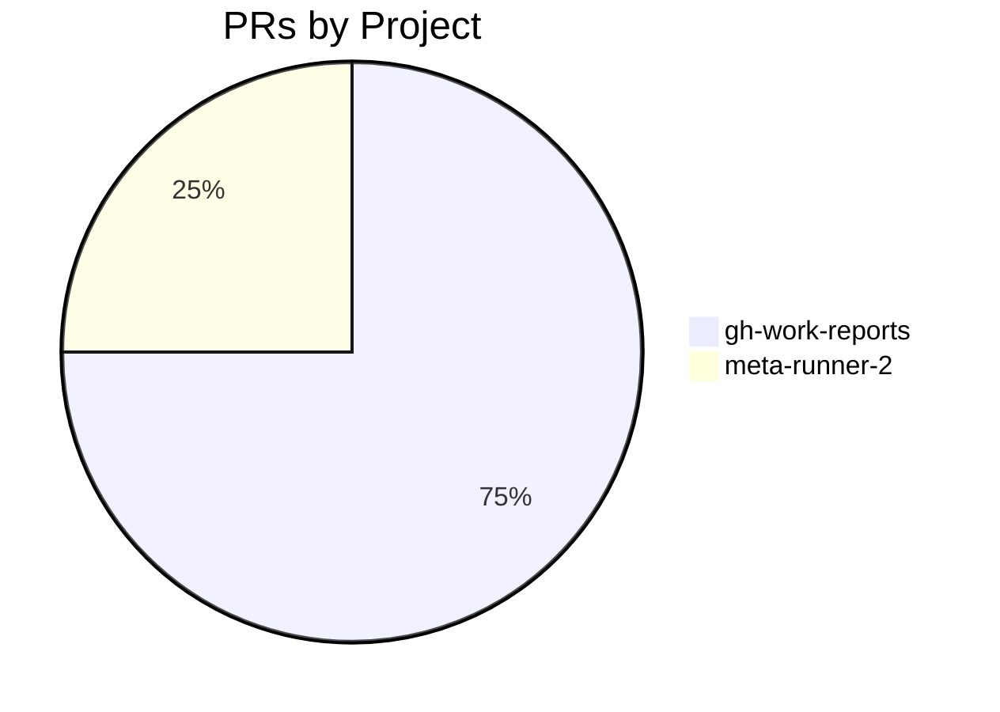
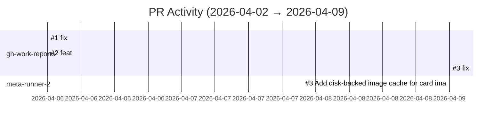

# GitHub Activity Report: 2026-04-02 → 2026-04-09

> **Generated**: 2026-04-09
> **Period**: 7 days

## Activity Summary

| Metric | Count |
|--------|-------|
| Projects active | 5 |
| PRs created | 4 |
| PRs merged | 4 |
| PRs open | 0 |
| Issues opened | 0 |

## PR Distribution

## Activity Timeline

## Pull Requests

### nlscng/gh-work-reports

| # | Title | Status | Created |
|---|-------|--------|---------|
| [#1](https://github.com/nlscng/gh-work-reports/pull/1) | fix: add git pull --rebase before push in workflows | ✅ Merged | 2026-04-06 |
| [#2](https://github.com/nlscng/gh-work-reports/pull/2) | feat: dual-token support for multi-account reports | ✅ Merged | 2026-04-06 |
| [#3](https://github.com/nlscng/gh-work-reports/pull/3) | fix: dual-account repo gathering and README | ✅ Merged | 2026-04-09 |

### nlscng/meta-runner-2

| # | Title | Status | Created |
|---|-------|--------|---------|
| [#3](https://github.com/nlscng/meta-runner-2/pull/3) | Add disk-backed image cache for card images | ✅ Merged | 2026-04-09 |

## Active Repositories

| Repository | Description | Last Push |
|-----------|-------------|-----------|
| [nlscng/gh-work-reports](https://github.com/nlscng/gh-work-reports) | Automated GitHub activity reports | 2026-04-09 |
| [nlscng/meta-runner-2](https://github.com/nlscng/meta-runner-2) | Agentic Netrunner meta learning agent — teaches metagame concepts through adapti | 2026-04-09 |
| [nlscng/ai-agents-for-beginners](https://github.com/nlscng/ai-agents-for-beginners) | — | 2026-04-09 |
| [nelsoncheng_microsoft/synthetic-data-foundation](https://github.com/nelsoncheng_microsoft/synthetic-data-foundation) | ADAPT Synthetic Data Foundation — data platform for simulation telemetry, labele | 2026-04-08 |
| [nelsoncheng_microsoft/gh-work-reports](https://github.com/nelsoncheng_microsoft/gh-work-reports) | Automated GitHub work reports with GitHub Pages | 2026-04-06 |
