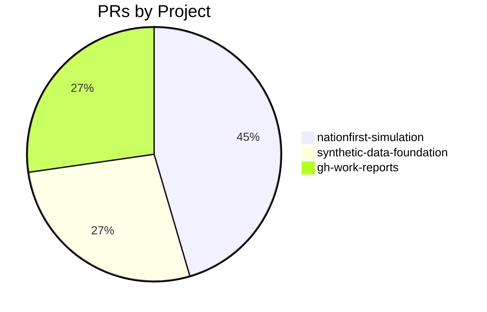

# GitHub Activity Report: 2026-04-06 → 2026-04-13

> **Generated**: 2026-04-13
> **Period**: 7 days

## Activity Summary

| Metric | Count |
|--------|-------|
| Projects active | 3 |
| PRs created | 11 |
| PRs merged | 11 |
| PRs open | 0 |
| Issues opened | 3 |

## Highlights

### 🚀 New Features

- **nationfirst-simulation**: feat: add adaptresearch003 data-plane cleanup script ([#40](https://github.com/cloud-ecosystem-security/nationfirst-simulation/pull/40))
- **nationfirst-simulation**: feat: auto-generate cleanup scripts during honeypots.yaml generation ([#41](https://github.com/cloud-ecosystem-security/nationfirst-simulation/pull/41))
- **nationfirst-simulation**: feat: add attack scenario users, payments workload, and SharePoint site ([#44](https://github.com/cloud-ecosystem-security/nationfirst-simulation/pull/44))
- **gh-work-reports**: feat: add highlights section and Copy for Teams button ([#5](https://github.com/nlscng/gh-work-reports/pull/5))

### 🔧 Bug Fixes & Improvements

- **nationfirst-simulation**: fix: address code review feedback on TAP backport PR ([#42](https://github.com/cloud-ecosystem-security/nationfirst-simulation/pull/42))
- **nationfirst-simulation**: fix: address code review feedback on TAP generation backport ([#43](https://github.com/cloud-ecosystem-security/nationfirst-simulation/pull/43))
- **gh-work-reports**: fix: dual-account repo gathering and README ([#3](https://github.com/nlscng/gh-work-reports/pull/3))

### ⚙️ CI/CD & Automation

- **synthetic-data-foundation**: Add daily issue reminder workflow ([#5](https://github.com/nelsoncheng_microsoft/synthetic-data-foundation/pull/5))

### 📝 Documentation

- **synthetic-data-foundation**: docs: Acar brainstorming meeting notes & consumer demand signal ([#1](https://github.com/nelsoncheng_microsoft/synthetic-data-foundation/pull/1))
- **synthetic-data-foundation**: docs: Noah brainstorming meeting notes & red team demand signal ([#2](https://github.com/nelsoncheng_microsoft/synthetic-data-foundation/pull/2))
- **gh-work-reports**: docs: add self-hosted runner setup instructions ([#4](https://github.com/nlscng/gh-work-reports/pull/4))

### 📋 Issues Opened

- **synthetic-data-foundation**: Daily Issue Reminders ([#6](https://github.com/nelsoncheng_microsoft/synthetic-data-foundation/issues/6))
- **synthetic-data-foundation**: Explore synthetic graph data generation for red agent (Ingressor) GNN training ([#4](https://github.com/nelsoncheng_microsoft/synthetic-data-foundation/issues/4))
- **synthetic-data-foundation**: Follow up: Orchestration meeting, Siva sync, Acar notification ([#3](https://github.com/nelsoncheng_microsoft/synthetic-data-foundation/issues/3))

## PR Distribution



## Activity Timeline

```mermaid
gantt
    title PR Activity (2026-04-06 → 2026-04-13)
    dateFormat YYYY-MM-DD
    section nationfirst-simulation
    #40 feat: add adaptresearch003 data-plane cl :done, 2026-04-07, 2026-04-07
    #41 feat: auto-generate cleanup scripts duri :done, 2026-04-08, 2026-04-10
    #42 fix: address code review feedback on TAP :done, 2026-04-08, 2026-04-08
    #43 fix: address code review feedback on TAP :done, 2026-04-08, 2026-04-08
    #44 feat: add attack scenario users, payment :done, 2026-04-09, 2026-04-10
    section synthetic-data-foundation
    #1 docs: Acar brainstorming meeting notes & :done, 2026-04-12, 2026-04-12
    #2 docs: Noah brainstorming meeting notes & :done, 2026-04-12, 2026-04-12
    #5 Add daily issue reminder workflow :done, 2026-04-12, 2026-04-12
    section gh-work-reports
    #3 fix: dual-account repo gathering and REA :done, 2026-04-09, 2026-04-09
    #4 docs: add self-hosted runner setup instr :done, 2026-04-13, 2026-04-13
    #5 feat: add highlights section and Copy fo :done, 2026-04-13, 2026-04-13
```

## Pull Requests

### cloud-ecosystem-security/nationfirst-simulation

| # | Title | Status | Created |
|---|-------|--------|---------|
| [#40](https://github.com/cloud-ecosystem-security/nationfirst-simulation/pull/40) | feat: add adaptresearch003 data-plane cleanup script | ✅ Merged | 2026-04-07 |
| [#41](https://github.com/cloud-ecosystem-security/nationfirst-simulation/pull/41) | feat: auto-generate cleanup scripts during honeypots.yaml generation | ✅ Merged | 2026-04-08 |
| [#42](https://github.com/cloud-ecosystem-security/nationfirst-simulation/pull/42) | fix: address code review feedback on TAP backport PR | ✅ Merged | 2026-04-08 |
| [#43](https://github.com/cloud-ecosystem-security/nationfirst-simulation/pull/43) | fix: address code review feedback on TAP generation backport | ✅ Merged | 2026-04-08 |
| [#44](https://github.com/cloud-ecosystem-security/nationfirst-simulation/pull/44) | feat: add attack scenario users, payments workload, and SharePoint site | ✅ Merged | 2026-04-09 |

### nelsoncheng_microsoft/synthetic-data-foundation

| # | Title | Status | Created |
|---|-------|--------|---------|
| [#1](https://github.com/nelsoncheng_microsoft/synthetic-data-foundation/pull/1) | docs: Acar brainstorming meeting notes & consumer demand signal | ✅ Merged | 2026-04-12 |
| [#2](https://github.com/nelsoncheng_microsoft/synthetic-data-foundation/pull/2) | docs: Noah brainstorming meeting notes & red team demand signal | ✅ Merged | 2026-04-12 |
| [#5](https://github.com/nelsoncheng_microsoft/synthetic-data-foundation/pull/5) | Add daily issue reminder workflow | ✅ Merged | 2026-04-12 |

### nlscng/gh-work-reports

| # | Title | Status | Created |
|---|-------|--------|---------|
| [#3](https://github.com/nlscng/gh-work-reports/pull/3) | fix: dual-account repo gathering and README | ✅ Merged | 2026-04-09 |
| [#4](https://github.com/nlscng/gh-work-reports/pull/4) | docs: add self-hosted runner setup instructions | ✅ Merged | 2026-04-13 |
| [#5](https://github.com/nlscng/gh-work-reports/pull/5) | feat: add highlights section and Copy for Teams button | ✅ Merged | 2026-04-13 |

## Issues

| # | Title | Repository | Status |
|---|-------|-----------|--------|
| [#6](https://github.com/nelsoncheng_microsoft/synthetic-data-foundation/issues/6) | Daily Issue Reminders | nelsoncheng_microsoft/synthetic-data-foundation | 🔵 Open |
| [#4](https://github.com/nelsoncheng_microsoft/synthetic-data-foundation/issues/4) | Explore synthetic graph data generation for red agent (Ingressor) GNN training | nelsoncheng_microsoft/synthetic-data-foundation | 🔵 Open |
| [#3](https://github.com/nelsoncheng_microsoft/synthetic-data-foundation/issues/3) | Follow up: Orchestration meeting, Siva sync, Acar notification | nelsoncheng_microsoft/synthetic-data-foundation | 🔵 Open |

## Active Repositories

| Repository | Description | Last Push |
|-----------|-------------|-----------|
| [nlscng/gh-work-reports](https://github.com/nlscng/gh-work-reports) | Automated GitHub activity reports | 2026-04-13 |
| [nelsoncheng_microsoft/synthetic-data-foundation](https://github.com/nelsoncheng_microsoft/synthetic-data-foundation) | ADAPT Synthetic Data Foundation — data platform for simulation telemetry, labele | 2026-04-12 |
| [cloud-ecosystem-security/nationfirst-simulation](https://github.com/cloud-ecosystem-security/nationfirst-simulation) | Adapt research - resources to deploy nationfirst simulation | 2026-04-12 |
