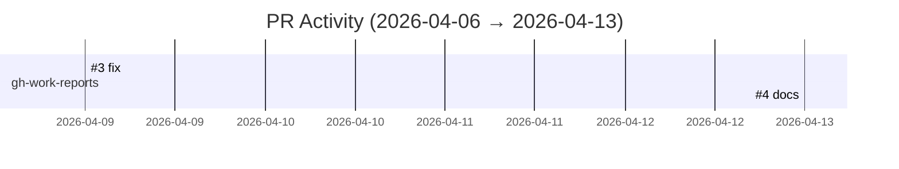

# GitHub Activity Report: 2026-04-06 → 2026-04-13

> **Generated**: 2026-04-13
> **Period**: 7 days

## Activity Summary

| Metric | Count |
|--------|-------|
| Projects active | 1 |
| PRs created | 2 |
| PRs merged | 2 |
| PRs open | 0 |
| Issues opened | 0 |

## Highlights

### 🔧 Bug Fixes & Improvements

- **gh-work-reports**: fix: dual-account repo gathering and README ([#3](https://github.com/nlscng/gh-work-reports/pull/3))

### 📝 Documentation

- **gh-work-reports**: docs: add self-hosted runner setup instructions ([#4](https://github.com/nlscng/gh-work-reports/pull/4))

## Activity Timeline

## Pull Requests

### nlscng/gh-work-reports

| # | Title | Status | Created |
|---|-------|--------|---------|
| [#3](https://github.com/nlscng/gh-work-reports/pull/3) | fix: dual-account repo gathering and README | ✅ Merged | 2026-04-09 |
| [#4](https://github.com/nlscng/gh-work-reports/pull/4) | docs: add self-hosted runner setup instructions | ✅ Merged | 2026-04-13 |

## Active Repositories

| Repository | Description | Last Push |
|-----------|-------------|-----------|
| [nlscng/gh-work-reports](https://github.com/nlscng/gh-work-reports) | Automated GitHub activity reports | 2026-04-13 |
