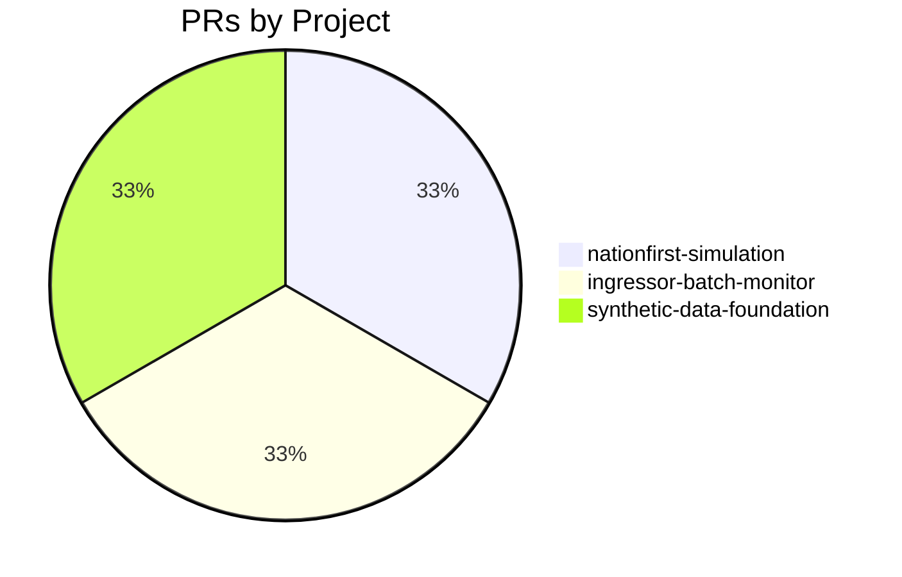
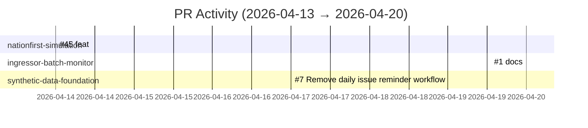

# GitHub Activity Report: 2026-04-13 → 2026-04-20

> **Generated**: 2026-04-20
> **Period**: 7 days

## Activity Summary

| Metric | Count |
|--------|-------|
| Projects active | 3 |
| PRs created | 3 |
| PRs merged | 3 |
| PRs open | 0 |
| Issues opened | 0 |

## Highlights

### 🚀 New Features

- **nationfirst-simulation**: feat: add killchain users and kv-prod-payments-use to honeypots inventory ([#45](https://github.com/cloud-ecosystem-security/nationfirst-simulation/pull/45))

### 📝 Documentation

- **ingressor-batch-monitor**: docs: clarify spec phase status in README ([#1](https://github.com/nelsoncheng_microsoft/ingressor-batch-monitor/pull/1))

### 🧹 Code Health

- **synthetic-data-foundation**: Remove daily issue reminder workflow ([#7](https://github.com/nelsoncheng_microsoft/synthetic-data-foundation/pull/7))

## PR Distribution

## Activity Timeline

## Pull Requests

### cloud-ecosystem-security/nationfirst-simulation

| # | Title | Status | Created |
|---|-------|--------|---------|
| [#45](https://github.com/cloud-ecosystem-security/nationfirst-simulation/pull/45) | feat: add killchain users and kv-prod-payments-use to honeypots inventory | ✅ Merged | 2026-04-14 |

### nelsoncheng_microsoft/ingressor-batch-monitor

| # | Title | Status | Created |
|---|-------|--------|---------|
| [#1](https://github.com/nelsoncheng_microsoft/ingressor-batch-monitor/pull/1) | docs: clarify spec phase status in README | ✅ Merged | 2026-04-20 |

### nelsoncheng_microsoft/synthetic-data-foundation

| # | Title | Status | Created |
|---|-------|--------|---------|
| [#7](https://github.com/nelsoncheng_microsoft/synthetic-data-foundation/pull/7) | Remove daily issue reminder workflow | ✅ Merged | 2026-04-17 |

## Active Repositories

| Repository | Description | Last Push |
|-----------|-------------|-----------|
| [nelsoncheng_microsoft/ingressor-batch-monitor](https://github.com/nelsoncheng_microsoft/ingressor-batch-monitor) | Stop-gap CLI to launch, monitor, and aggregate stats for ingressor red-team batc | 2026-04-20 |
| [cloud-ecosystem-security/nationfirst-simulation](https://github.com/cloud-ecosystem-security/nationfirst-simulation) | Adapt research - resources to deploy nationfirst simulation | 2026-04-20 |
| [nelsoncheng_microsoft/synthetic-data-foundation](https://github.com/nelsoncheng_microsoft/synthetic-data-foundation) | ADAPT Synthetic Data Foundation — data platform for simulation telemetry, labele | 2026-04-17 |
