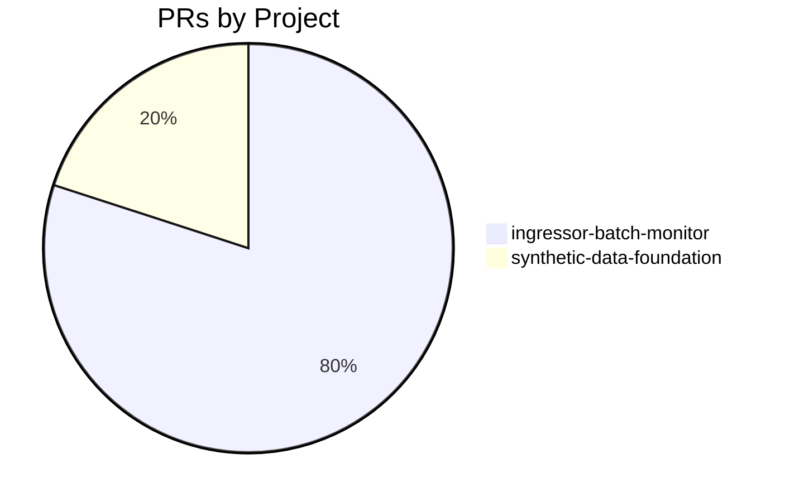

# GitHub Activity Report: 2026-04-15 → 2026-04-22

> **Generated**: 2026-04-23
> **Period**: 7 days

## Activity Summary

| Metric | Count |
|--------|-------|
| Projects active | 2 |
| PRs created | 5 |
| PRs merged | 4 |
| PRs open | 1 |
| Issues opened | 0 |

## Highlights

### 📝 Documentation

- **ingressor-batch-monitor**: docs: clarify spec phase status in README ([#1](https://github.com/nelsoncheng_microsoft/ingressor-batch-monitor/pull/1))

### 🧹 Code Health

- **synthetic-data-foundation**: Remove daily issue reminder workflow ([#7](https://github.com/nelsoncheng_microsoft/synthetic-data-foundation/pull/7))

### 📦 Other Work

- **ingressor-batch-monitor**: mission: tighten CLI shape, ingressor ref pinning, at-a-glance monitor signal ([#2](https://github.com/nelsoncheng_microsoft/ingressor-batch-monitor/pull/2))
- **ingressor-batch-monitor**: mission: add Terminology section ([#3](https://github.com/nelsoncheng_microsoft/ingressor-batch-monitor/pull/3))
- **ingressor-batch-monitor**: spec: requirements.md skeleton (structure-only) ([#4](https://github.com/nelsoncheng_microsoft/ingressor-batch-monitor/pull/4))

## PR Distribution



## Activity Timeline

```mermaid
gantt
    title PR Activity (2026-04-15 → 2026-04-22)
    dateFormat YYYY-MM-DD
    section ingressor-batch-monitor
    #1 docs: clarify spec phase status in READM :done, 2026-04-20, 2026-04-20
    #2 mission: tighten CLI shape, ingressor re :done, 2026-04-20, 2026-04-21
    #3 mission: add Terminology section :done, 2026-04-21, 2026-04-21
    #4 spec: requirements.md skeleton (structur :active, 2026-04-21, 2026-04-21
    section synthetic-data-foundation
    #7 Remove daily issue reminder workflow :done, 2026-04-17, 2026-04-17
```

## Pull Requests

### nelsoncheng_microsoft/ingressor-batch-monitor

| # | Title | Status | Created |
|---|-------|--------|---------|
| [#1](https://github.com/nelsoncheng_microsoft/ingressor-batch-monitor/pull/1) | docs: clarify spec phase status in README | ✅ Merged | 2026-04-20 |
| [#2](https://github.com/nelsoncheng_microsoft/ingressor-batch-monitor/pull/2) | mission: tighten CLI shape, ingressor ref pinning, at-a-glance monitor signal | ✅ Merged | 2026-04-20 |
| [#3](https://github.com/nelsoncheng_microsoft/ingressor-batch-monitor/pull/3) | mission: add Terminology section | ✅ Merged | 2026-04-21 |
| [#4](https://github.com/nelsoncheng_microsoft/ingressor-batch-monitor/pull/4) | spec: requirements.md skeleton (structure-only) | 🔵 Open | 2026-04-21 |

### nelsoncheng_microsoft/synthetic-data-foundation

| # | Title | Status | Created |
|---|-------|--------|---------|
| [#7](https://github.com/nelsoncheng_microsoft/synthetic-data-foundation/pull/7) | Remove daily issue reminder workflow | ✅ Merged | 2026-04-17 |

## Active Repositories

| Repository | Description | Last Push |
|-----------|-------------|-----------|
| [nelsoncheng_microsoft/ingressor-batch-monitor](https://github.com/nelsoncheng_microsoft/ingressor-batch-monitor) | Stop-gap CLI to launch, monitor, and aggregate stats for ingressor red-team batc | 2026-04-21 |
| [nelsoncheng_microsoft/synthetic-data-foundation](https://github.com/nelsoncheng_microsoft/synthetic-data-foundation) | ADAPT Synthetic Data Foundation — data platform for simulation telemetry, labele | 2026-04-17 |
