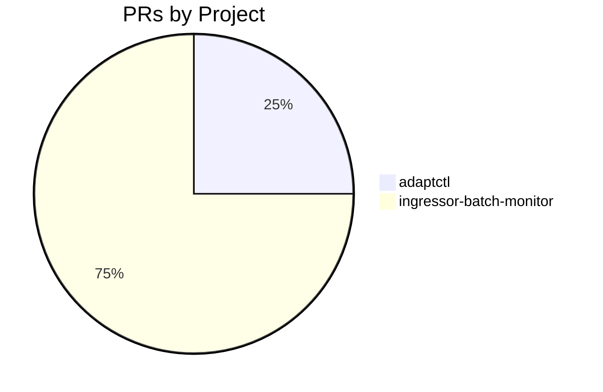

# GitHub Activity Report: 2026-04-20 → 2026-04-27

> **Generated**: 2026-04-27
> **Period**: 7 days

## Activity Summary

| Metric | Count |
|--------|-------|
| Projects active | 2 |
| PRs created | 4 |
| PRs merged | 2 |
| PRs open | 2 |
| Issues opened | 1 |

## Highlights

### 🚀 New Features

- **adaptctl**: feat: add 'close incident' to resolve Defender XDR incidents ([#86](https://github.com/cloud-ecosystem-security/adaptctl/pull/86))

### 📦 Other Work

- **ingressor-batch-monitor**: mission: tighten CLI shape, ingressor ref pinning, at-a-glance monitor signal ([#2](https://github.com/nelsoncheng_microsoft/ingressor-batch-monitor/pull/2))
- **ingressor-batch-monitor**: mission: add Terminology section ([#3](https://github.com/nelsoncheng_microsoft/ingressor-batch-monitor/pull/3))
- **ingressor-batch-monitor**: spec: requirements.md skeleton (structure-only) ([#4](https://github.com/nelsoncheng_microsoft/ingressor-batch-monitor/pull/4))

### 📋 Issues Opened

- **adaptctl**: close incident: handle XDR ↔ Sentinel ID disconnect (backend flag, ID translation, or unified close) ([#87](https://github.com/cloud-ecosystem-security/adaptctl/issues/87))

## PR Distribution



## Activity Timeline

```mermaid
gantt
    title PR Activity (2026-04-20 → 2026-04-27)
    dateFormat YYYY-MM-DD
    section adaptctl
    #86 feat: add 'close incident' to resolve De :active, 2026-04-24, 2026-04-24
    section ingressor-batch-monitor
    #2 mission: tighten CLI shape, ingressor re :done, 2026-04-20, 2026-04-21
    #3 mission: add Terminology section :done, 2026-04-21, 2026-04-21
    #4 spec: requirements.md skeleton (structur :active, 2026-04-21, 2026-04-21
```

## Pull Requests

### cloud-ecosystem-security/adaptctl

| # | Title | Status | Created |
|---|-------|--------|---------|
| [#86](https://github.com/cloud-ecosystem-security/adaptctl/pull/86) | feat: add 'close incident' to resolve Defender XDR incidents | 🔵 Open | 2026-04-24 |

### nelsoncheng_microsoft/ingressor-batch-monitor

| # | Title | Status | Created |
|---|-------|--------|---------|
| [#2](https://github.com/nelsoncheng_microsoft/ingressor-batch-monitor/pull/2) | mission: tighten CLI shape, ingressor ref pinning, at-a-glance monitor signal | ✅ Merged | 2026-04-20 |
| [#3](https://github.com/nelsoncheng_microsoft/ingressor-batch-monitor/pull/3) | mission: add Terminology section | ✅ Merged | 2026-04-21 |
| [#4](https://github.com/nelsoncheng_microsoft/ingressor-batch-monitor/pull/4) | spec: requirements.md skeleton (structure-only) | 🔵 Open | 2026-04-21 |

## Issues

| # | Title | Repository | Status |
|---|-------|-----------|--------|
| [#87](https://github.com/cloud-ecosystem-security/adaptctl/issues/87) | close incident: handle XDR ↔ Sentinel ID disconnect (backend flag, ID translation, or unified close) | cloud-ecosystem-security/adaptctl | 🔵 Open |

## Active Repositories

| Repository | Description | Last Push |
|-----------|-------------|-----------|
| [cloud-ecosystem-security/adaptctl](https://github.com/cloud-ecosystem-security/adaptctl) | Utility for managing simulation environments | 2026-04-24 |
| [nelsoncheng_microsoft/ingressor-batch-monitor](https://github.com/nelsoncheng_microsoft/ingressor-batch-monitor) | Stop-gap CLI to launch, monitor, and aggregate stats for ingressor red-team batc | 2026-04-21 |
