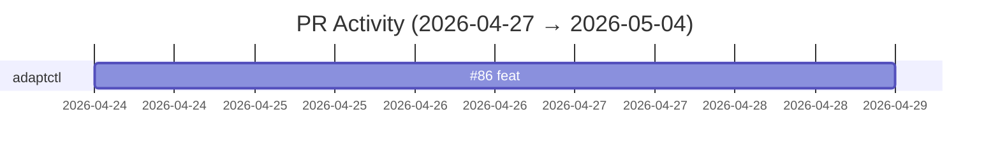

# GitHub Activity Report: 2026-04-27 → 2026-05-04

> **Generated**: 2026-05-04
> **Period**: 7 days

## Activity Summary

| Metric | Count |
|--------|-------|
| Projects active | 1 |
| PRs created | 1 |
| PRs merged | 1 |
| PRs open | 0 |
| Issues opened | 0 |

## Highlights

### 🚀 New Features

- **adaptctl**: feat: add 'close incident' to resolve Defender XDR incidents ([#86](https://github.com/cloud-ecosystem-security/adaptctl/pull/86))

## Activity Timeline

## Pull Requests

### cloud-ecosystem-security/adaptctl

| # | Title | Status | Created |
|---|-------|--------|---------|
| [#86](https://github.com/cloud-ecosystem-security/adaptctl/pull/86) | feat: add 'close incident' to resolve Defender XDR incidents | ✅ Merged | 2026-04-24 |

## Active Repositories

| Repository | Description | Last Push |
|-----------|-------------|-----------|
| [cloud-ecosystem-security/adaptctl](https://github.com/cloud-ecosystem-security/adaptctl) | Utility for managing simulation environments | 2026-04-29 |
