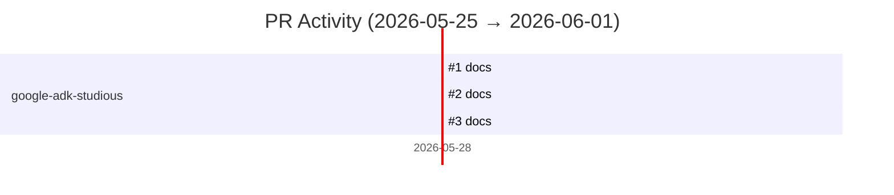

# GitHub Activity Report: 2026-05-25 → 2026-06-01

> **Generated**: 2026-06-01
> **Period**: 7 days

## Activity Summary

| Metric | Count |
|--------|-------|
| Projects active | 1 |
| PRs created | 3 |
| PRs merged | 2 |
| PRs open | 0 |
| Issues opened | 0 |

## Highlights

### 📝 Documentation

- **google-adk-studious**: docs: adopt spec-driven dev — add mission and expand README ([#1](https://github.com/nlscng/google-adk-studious/pull/1))
- **google-adk-studious**: docs: establish why/what/how hierarchy (SPEC.md + DESIGN.md) ([#2](https://github.com/nlscng/google-adk-studious/pull/2))
- **google-adk-studious**: docs: establish why/what/how hierarchy (SPEC.md + DESIGN.md) ([#3](https://github.com/nlscng/google-adk-studious/pull/3))

## Activity Timeline

## Pull Requests

### nlscng/google-adk-studious

| # | Title | Status | Created |
|---|-------|--------|---------|
| [#1](https://github.com/nlscng/google-adk-studious/pull/1) | docs: adopt spec-driven dev — add mission and expand README | ✅ Merged | 2026-05-28 |
| [#2](https://github.com/nlscng/google-adk-studious/pull/2) | docs: establish why/what/how hierarchy (SPEC.md + DESIGN.md) | ❌ Closed | 2026-05-28 |
| [#3](https://github.com/nlscng/google-adk-studious/pull/3) | docs: establish why/what/how hierarchy (SPEC.md + DESIGN.md) | ✅ Merged | 2026-05-28 |

## Active Repositories

| Repository | Description | Last Push |
|-----------|-------------|-----------|
| [nlscng/google-adk-studious](https://github.com/nlscng/google-adk-studious) | — | 2026-05-28 |
