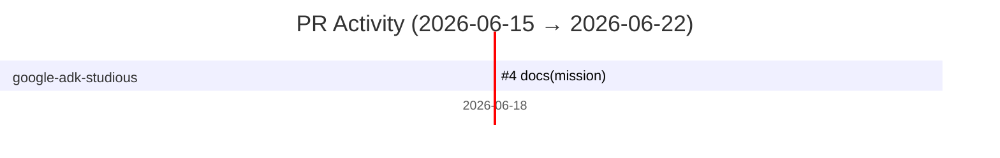

# GitHub Activity Report: 2026-06-15 → 2026-06-22

> **Generated**: 2026-06-22
> **Period**: 7 days

## Activity Summary

| Metric | Count |
|--------|-------|
| Projects active | 1 |
| PRs created | 1 |
| PRs merged | 1 |
| PRs open | 0 |
| Issues opened | 0 |

## Highlights

### 📝 Documentation

- **google-adk-studious**: docs(mission): add algorithmic-vs-agent comparison framing ([#4](https://github.com/nlscng/google-adk-studious/pull/4))

## Activity Timeline

## Pull Requests

### nlscng/google-adk-studious

| # | Title | Status | Created |
|---|-------|--------|---------|
| [#4](https://github.com/nlscng/google-adk-studious/pull/4) | docs(mission): add algorithmic-vs-agent comparison framing | ✅ Merged | 2026-06-18 |

## Active Repositories

| Repository | Description | Last Push |
|-----------|-------------|-----------|
| [nlscng/google-adk-studious](https://github.com/nlscng/google-adk-studious) | — | 2026-06-18 |
